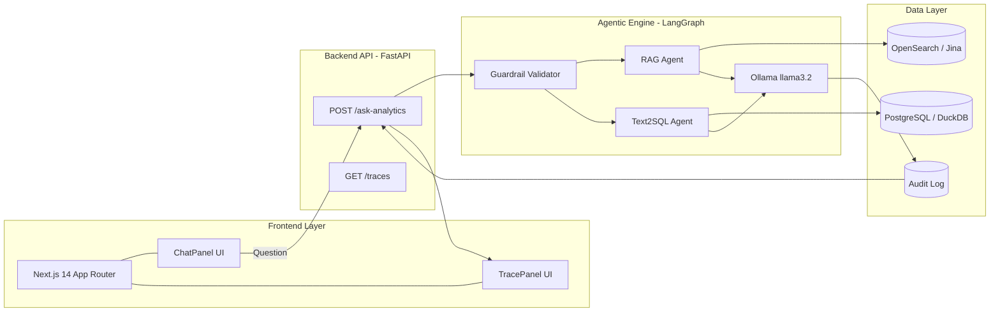
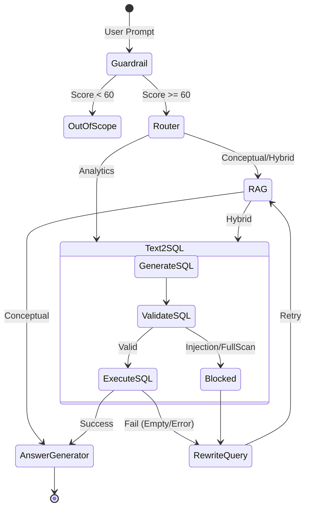
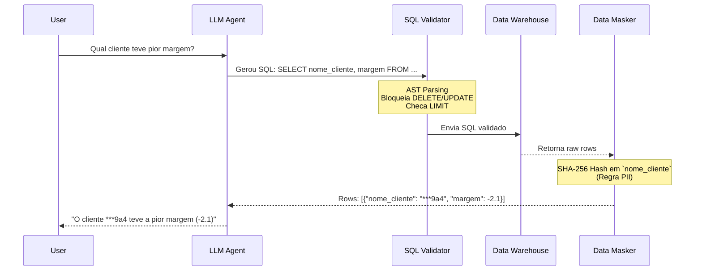
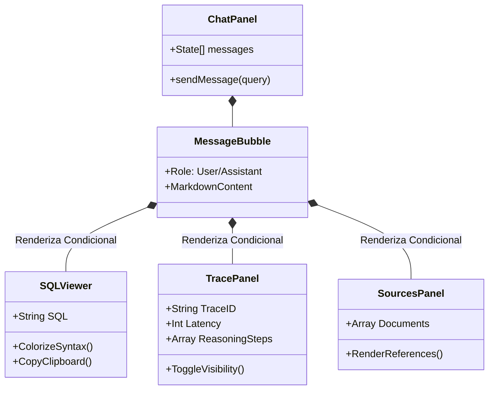

# 🏗️ Agentic Analytics — Arquitetura de Sistema

Este documento detalha o desenho técnico da plataforma **Agentic Analytics**, focada em consultas seguras e governadas para Data Warehousing financeiro.

---

## 1. Topologia Macro

O sistema segue uma abordagem *Headless Agent* onde um backend em FastAPI expõe rotas conversacionais governadas para um Frontend Next.js.

---

## 2. Padrão de Design LangGraph (Week 7 Pattern)

O coração do sistema utiliza um design focado em recuperação e robustez (Resilience by Design). 

1. **Routing:** Todo o tráfego é pontuado por um *Guardrail* (score de 0 a 100).
2. **Retrieve:** Documentos e queries SQL são tentados.
3. **Grade / Rewrite:** O `SQLValidator` funciona como *grader*. Se uma query é bloqueada ou falha na execução, a LLM entra em um loop para *Reescrever a Query* (`rewrite_query`).
4. **Answer:** O compilado de logs analíticos é traduzido em insight narrativo humano.

---

## 3. Data Flow & Security (Zero Trust Model)

A segurança em arquiteturas Agentic/Text-to-SQL é uma prioridade crítica. Este sistema implementa uma pipeline *Zero Trust* em 3 estágios.

### Regras do SQL Validator:
- **Parse Árvore (AST):** O validator utiliza análise léxica em vez de Regex para detectar injeção nas cláusulas de `WHERE`, `JOIN` ou comentários obscurecidos.
- **DML Bloqueado:** `INSERT`, `UPDATE`, `DELETE`, `MERGE` são vetados instantaneamente.
- **Cardinality Budgeting:** Queries que atingem tabelas gigantes (ex: `fact_pricing_snapshot`) obrigatoriamente precisam de um teto estrito na devolução (`LIMIT`).

---

## 4. Estrutura de Componentes da UI (Next.js)

O painel de chat não é apenas uma caixa de texto. O modelo cognitivo do usuário se apoia na transparência dos Agentes através de *Componentes Plugáveis*.

A interface foi projetada em **Dark Mode Premium**, focando na legibilidade de código (`SQLViewer` utiliza tipografia mono-espaçada nativa e realce sintático iterado de tokens como `SELECT` e `GROUP BY`). O `TracePanel` garante que o usuário entenda precisamente **como** e **por que** a IA tomou certas decisões.
