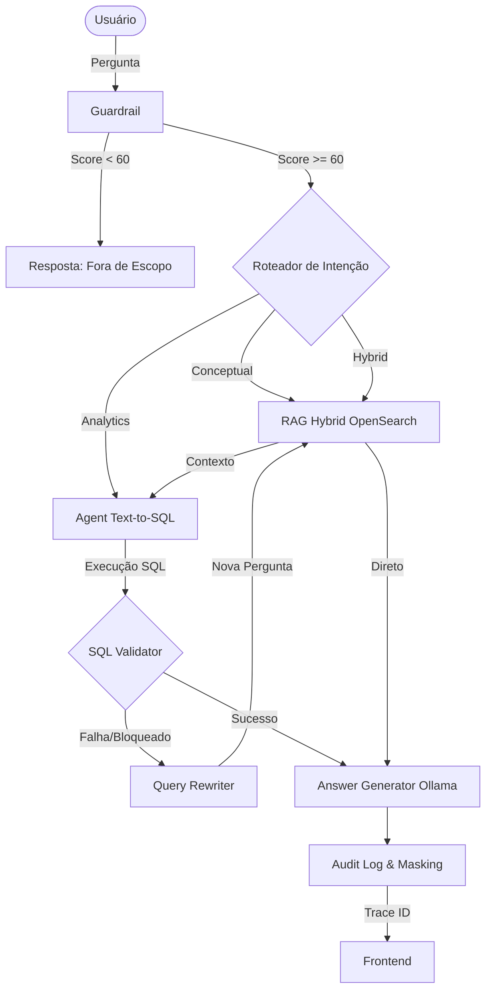

# 🧠 Agentic Analytics — Pricing, Margem, Safra, Risco & ROAE

> Plataforma analítica conversacional governada para análise de pricing, margem, safra, risco de crédito e ROAE.
> Arquitetura agentic com LangGraph, RAG híbrido (OpenSearch) e Text-to-SQL com validação de segurança.

## Arquitetura

> [!NOTE]
> O fluxo do sistema é governado pelo LangGraph, com roteamento de intenção e recuperação de falhas embutido.



## Stack

| Camada | Tecnologia |
|---|---|
| Backend | FastAPI + Python 3.12 + uv |
| Orquestração | LangGraph (7 nós, padrão Week7) |
| RAG | OpenSearch 2.13 (BM25 + vector, 60/40) |
| Embeddings | Jina v3 (API) / sentence-transformers (local) |
| Text-to-SQL | DuckDB (dev) / PostgreSQL (prod) |
| LLM | Ollama llama3.2:1b (local, gratuito) |
| Frontend | Next.js 14 (em construção) |
| Segurança | SQL Validator + PII Masking + Cost Limiter |

## Início Rápido

```bash
# 1. Clone e configure
cp .env.example .env
# Edite .env com suas chaves (Jina opcional, OpenAI opcional)

# 2. Backend
cd apps/backend
uv venv && uv pip install -e ".[dev]"
uvicorn app.main:app --reload --port 8000

# 3. Docker (OpenSearch + PostgreSQL + Ollama)
cd infra
docker compose up -d opensearch postgres ollama

# 4. Testes
cd apps/backend
python -m pytest tests/unit tests/security -v
```

## Endpoints

| Método | Endpoint | Descrição |
|---|---|---|
| GET | `/api/v1/health` | Status de todos os serviços |
| POST | `/api/v1/ask-analytics` | Pergunta agentic (RAG + SQL) |
| POST | `/api/v1/search-rules` | Busca RAG de regras |
| GET | `/api/v1/traces/{id}` | Consulta de trace de auditoria |
| GET | `/api/docs` | Swagger UI |

## Exemplo de Uso

```bash
curl -X POST http://localhost:8000/api/v1/ask-analytics \
  -H "Content-Type: application/json" \
  -d '{"question": "Qual segmento teve pior ROAE na última safra?"}'
```

```json
{
  "trace_id": "uuid",
  "data": {
    "trace_id": "uuid",
    "answer": "O segmento Varejo apresentou o menor ROAE médio...",
    "routed_path": "analytics",
    "reasoning_steps": ["Validated query scope (score: 82/100)", "Generated and executed SQL (50 rows returned)", "Generated answer from context"],
    "sql": "SELECT segmento, AVG(roae)...",
    "masked_fields": ["cliente_id"],
    "latency_ms": 1240
  }
}
```

## Segurança

> [!IMPORTANT]
> **Zero Trust Data Policy**: O sistema opera sob um modelo onde a LLM não tem acesso aos dados diretos e a interface de usuário recebe informações censuradas de PII.

- **SQL Validator**: Bloqueia DDL, DML, multi-statement, full-scan sem LIMIT, funções perigosas.
- **PII Masking**: Algoritmo unidirecional `SHA-256` truncado nos campos sensíveis (`cliente_id`, `cpf`, `cnpj`, `nome_cliente`) que mascaram dados antes de atingir a UI ou a LLM.
- **Cost Limiter**: Bloqueia queries que excedem o orçamento definido de cardinalidade para proteger a integridade do Data Warehouse.
- **Audit Log**: Todo evento gera um rastro contendo `trace_id`, latência e SQL disparado.

## Testes (100% de Cobertura de Caminho Crítico ✅)

```bash
# Execução Backend
python -m pytest tests/ -v
# Execução Frontend
npm test
```

| Camada | Ferramenta | Descrição |
|---|---|---|
| Frontend (UI) | Jest + RTL | 39 testes: Renderização de componentes, simulação de eventos e mocks de API. |
| Backend (Unit) | Pytest | 59 testes: Validações estáticas de AST de SQL, Masking e Guardrails. |
| Backend (Integração)| Pytest | Testes de rota `ask-analytics` do LangGraph, DuckDB Fallback, roteamentos RAG vs SQL. |
| Backend (Segurança) | Pytest | Casos avançados de evasão de SQL Injection (Comentários ocultos, UNION, etc) e Data Leakage. |
| E2E | Playwright | Mock de rotas web, renderização interativa do painel e fluxo do usuário final. |

| Suite | Arquivo | Cobertura |
|---|---|---|
| Unit — SQL Validator | test_sql_validator.py | DDL, DML, injection, CTE, subquery |
| Unit — Masking | test_masking.py | PII hash, preservação, batch |
| Unit — Guardrail | test_guardrail.py | In-scope, out-of-scope, intents |
| Security | test_sql_injection.py | SQL injection, PII leakage, full scan |

## Estrutura

```
agentic-analytics/
├── apps/backend/
│   ├── app/
│   │   ├── main.py              # FastAPI + CORS + trace middleware
│   │   ├── config.py            # Settings (pydantic-settings)
│   │   ├── agent/
│   │   │   ├── graph.py         # LangGraph 7 nós
│   │   │   ├── guardrail.py     # Score 0-100, threshold 60
│   │   │   ├── rag_agent.py     # OpenSearch hybrid 60/40
│   │   │   ├── text2sql_agent.py# execute_sql + validator
│   │   │   ├── query_rewriter.py
│   │   │   └── answer_generator.py
│   │   ├── api/v1/
│   │   │   ├── ask_analytics.py # POST /ask-analytics
│   │   │   ├── health.py        # GET /health
│   │   │   ├── search_rules.py  # POST /search-rules
│   │   │   └── traces.py        # GET /traces/{id}
│   │   ├── security/
│   │   │   ├── sql_validator.py # Bloqueio DDL/DML/injection
│   │   │   ├── masking.py       # SHA-256 PII masking
│   │   │   └── cost_limiter.py  # Orçamento de query
│   │   └── tracing/
│   │       └── audit.py         # Audit log PostgreSQL/DuckDB/JSONL
│   └── tests/
│       ├── unit/                # Sem dependências externas
│       ├── security/            # SQL injection + PII leakage
│       ├── integration/         # Precisa Docker
│       └── e2e/                 # Playwright
├── data/
│   ├── seeds/                   # generate_pricing.py + JSON
│   ├── scenarios/scenarios.md   # Regras text2sql (pricing domain)
│   └── docs/                    # Documentos para RAG
├── infra/
│   └── docker-compose.yml       # OpenSearch + PostgreSQL + Ollama
└── .env.example
```

## Roadmap

- [x] Fase 1: Infra + Scaffold
- [x] Fase 2: Dados e Catálogo (1908 snapshots gerados)
- [x] Fase 3: Segurança + 59 testes unitários (100% passando)
- [x] Fase 4: RAG Agent (com fallback local)
- [x] Fase 5: Agentic Core (LangGraph 7 nós)
- [x] Fase 6: Frontend Next.js (Dashboard Premium com Dark Mode)
- [x] Fase 7: Testes de Integração + E2E + Validação Visual

## Perguntas de Demo

1. `"O que significa safra nesta base?"` → RAG
2. `"Qual foi a margem média por safra no segmento PME?"` → SQL
3. `"Quais produtos tiveram pior ROAE na última safra?"` → SQL
4. `"Explique alto risco e compare inadimplência por safra"` → Híbrido
5. `"Gere diagnóstico da queda de margem da safra 2026-03"` → Híbrido + Report
