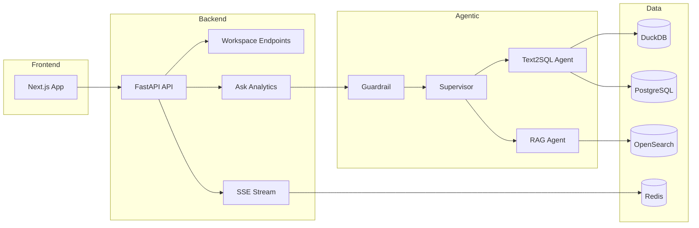

# Objetivo
Registrar a arquitetura de referência com foco em rastreabilidade e governança para desenvolvimento guiado por especificação.

## Diagrama de Alto Nível

## Legenda
- Frontend consome endpoints REST e canal SSE.
- Backend injeta `trace_id` por request e o propaga no payload JSON.
- Orquestração usa guardrails e roteamento por intenção.
- Camadas de dados permanecem protegidas por validações de segurança e políticas de mascaramento.
