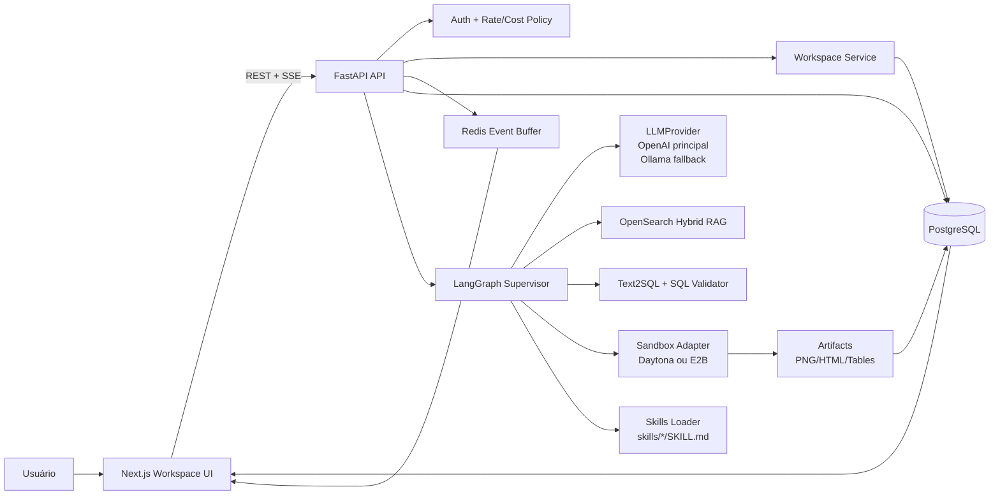
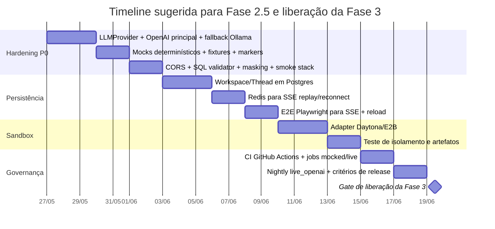

# Auditoria analítica do data_master_ia frente ao LangAlpha

## Resumo executivo

Há um bom trabalho do Antigravity na **camada de arquitetura** do `data_master_ia`: o plano já converge para um monorepo com **FastAPI**, **Next.js**, **LangGraph**, **OpenSearch**, **Text2SQL**, **Docker Compose**, **validação SQL**, **masking de PII** e uma taxonomia explícita de testes **unit**, **integration**, **security** e **e2e**. Em outras palavras, o desenho-base já saiu do estágio de ideia solta e entrou no estágio de sistema plausível. fileciteturn0file0

O ponto crítico, porém, é que **arquitetura desenhada não equivale a garantia de funcionamento**. O LangAlpha só atinge o patamar de “research workbench” porque combina **workspaces persistentes**, **sandboxes isolados**, **skills**, **swarm de agentes**, **Redis para replay/reconexão de SSE** e **PostgreSQL para estado durável**, além de uma **camada multi-provider** com failover. Essa é a régua correta para comparar a próxima etapa do seu projeto. citeturn37view0turn38view0turn23view0

O diagnóstico estratégico é direto: **não liberar a Fase 3 ainda**. Antes, o `data_master_ia` precisa de uma **Fase 2.5 de hardening** focada em TDD, CI/CD, OpenAI oficial como provider principal com fallback Ollama, separação rigorosa entre testes reais e simulados, persistência de workspaces/threads, isolamento verificável de sandbox e critérios de bloqueio de CI. Isso é o que transforma o sistema em algo estável, previsível e defendível na banca — e não apenas “funcional na demo”. As próprias documentações oficiais reforçam que o caminho correto é: testes automatizados no FastAPI com `pytest`/`TestClient`, E2E em CI com Playwright, CORS com origens explícitas, e uso consciente de rate limits, headers e backoff na API da OpenAI. citeturn28view0turn29view1turn36view2turn18view2turn19view1

Há uma limitação metodológica importante: **nesta sessão não foi possível recuperar o conteúdo bruto do repositório público diretamente do GitHub**, então este relatório distingue explicitamente entre o que foi **verificado em artefatos e fontes oficiais** e o que ainda está **pendente de prova automatizada no código do repo**. Essa distinção é uma virtude, não uma fraqueza: ela deixa claro exatamente o que precisa virar teste antes de qualquer evolução arquitetural mais pesada.

## Base de evidências e suposições

A base deste relatório combina três níveis de evidência. O primeiro é composto por **fontes oficiais e primárias**: documentação da OpenAI, Playwright, FastAPI, OpenSearch, Daytona, E2B e o próprio repositório público do LangAlpha. O segundo é o **artefato de plano entregue pelo Antigravity**, que já descreve stack, milestones, módulos e estratégia de testes para o seu projeto. O terceiro são **achados prévios do Antigravity mencionados nesta conversa**, úteis como sinais de risco, mas que continuam exigindo revalidação por teste automatizado. fileciteturn0file0 citeturn37view0turn38view0turn23view0turn36view1turn36view0turn34view1turn28view0turn36view2turn14view1

| Nível de evidência | Significado prático | Como tratar |
|---|---|---|
| Verificado | Visto em fonte oficial ou artefato entregue | Pode orientar decisão imediatamente |
| Indício forte | Sinal prévio do Antigravity nesta conversa | Exigir teste antes de confiar |
| Pendente de prova | Não foi possível confirmar no repo nesta sessão | Não usar como premissa de Fase 3 |

As suposições não especificadas que assumi para fechar o relatório foram estas: **CI em GitHub Actions**, **provedor de sandbox ainda em decisão entre Daytona e E2B**, **OpenAI como provider principal de produção**, **Ollama como fallback local**, **estrutura de monorepo próxima da descrita no plano do Antigravity**, e **uma equipe operacional equivalente a 1 dev full-stack principal com apoio parcial de infra/QA**. Essas suposições são coerentes com o desenho do plano e com a arquitetura pública do LangAlpha. fileciteturn0file0 citeturn38view0turn36view1turn36view0

## Comparativo arquitetural com LangAlpha

O LangAlpha é uma boa referência não porque “usa IA”, mas porque já resolve exatamente os problemas de maturidade que o `data_master_ia` está começando a encontrar: **pesquisa longa**, **estado persistente**, **PTC**, **skills**, **subagentes**, **frontend de artefatos**, **replay de SSE**, **persistência em Postgres**, **cache/event buffer em Redis** e **sandboxes dedicados**. O repositório público mostra uma separação nítida entre `src`, `web`, `skills`, `tests`, `migrations`, `mcp_servers`, `docker-compose.yml` e `Dockerfile.sandbox`, enquanto o README descreve workspaces persistentes, PTC, provider layer com failover e infraestrutura “production-ready” com Redis-buffered reconnect replay e PostgreSQL-backed state persistence. citeturn37view0turn38view0turn22view0turn22view1turn23view0

| Componente | data_master_ia no estado da evidência disponível | LangAlpha | Gap principal | Esforço estimado |
|---|---|---|---|---|
| Estrutura de pastas | Monorepo com `apps/backend`, `apps/frontend`, `data`, `infra`, `docs` foi claramente planejado pelo Antigravity. fileciteturn0file0 | Estrutura real com `src`, `web`, `skills`, `tests`, `migrations`, `mcp_servers`, `deploy`. citeturn37view0 | Falta provar aderência do código real ao desenho | Baixo |
| Backend FastAPI | Routers, `main.py`, segurança, tracing, agent graph e serviços estão explicitamente previstos. fileciteturn0file0 | Backend real com API routers, workspaces, threads, automations e WebSocket proxy. citeturn37view0 | Faltam smoke tests e contract tests executando tudo | Médio |
| Frontend | Next.js 14 com ChatPanel, TracePanel, SQLViewer e streaming SSE foi desenhado. fileciteturn0file0 | LangAlpha usa `web` com Vite/React, e2e próprios, file viewer, charts e monitoramento de subagentes. citeturn24view0turn22view1turn37view0 | Falta persistência visual de workspace e render de artefatos ricos | Médio |
| LangGraph/agents | Fluxo de 7 nós, guardrail, retry e reasoning steps já está muito bem especificado. fileciteturn0file0 | LangAlpha vai além: swarm paralelo, steering, checkpoints e camadas de middleware. citeturn37view0 | Falta evoluir de fluxo monolítico para supervisor + especialistas | Alto |
| Text2SQL | Há previsão de `text2sql_agent.py`, cenários e SQL validator. fileciteturn0file0 | LangAlpha não é Text2SQL-first; o análogo real é PTC + ferramentas financeiras. citeturn37view0 | Seu diferencial continua válido; precisa só ser endurecido | Médio |
| RAG/OpenSearch | Hybrid search, chunking, embeddings e índice mapeado já foram planejados com bastante precisão. fileciteturn0file0 | LangAlpha foca mais em ferramentas e pesquisa financeira do que em um RAG clássico regulatório. citeturn37view0 | O gap aqui é menos arquitetural e mais de prova/eval | Médio |
| LLM provider | Plano prevê Ollama + OpenAI fallback. fileciteturn0file0 | LangAlpha usa camada provider-agnostic com failover automático. citeturn37view0turn23view3 | É preciso inverter: OpenAI oficial como principal; Ollama fallback | Baixo |
| Persistência | Workspaces/threads e Redis foram propostos em evolução posterior, mas não há prova automatizada nesta sessão. fileciteturn0file0 | LangAlpha tem Postgres, Redis, checkpointer e replay de SSE. citeturn37view0turn38view0 | Este é o maior gap atual | Alto |
| Sandbox/PTC | `sandbox_executor.py` e skills foram propostos, com Daytona/E2B como decisão pendente. fileciteturn0file0 | LangAlpha usa Daytona e PTC como eixo central. citeturn37view0turn36view1 | Falta adapter, isolamento testado e persistência de artefatos | Alto |
| Skills | Diretório `skills/` com `SKILL.md` foi previsto. fileciteturn0file0 | LangAlpha já possui dezenas de skills por domínio. citeturn22view0turn37view0 | Falta loader, ativação e testes | Médio |
| Testes e CI | O plano já prevê unit, integration, security e e2e, mas não amarra isso a gates claros de CI ainda. fileciteturn0file0 | LangAlpha já traz `tests`, `web/e2e`, Playwright e dependências de observabilidade. citeturn37view0turn22view1turn23view0 | Falta política de bloqueio e segregação live vs mock | Alto |

A conclusão da comparação é simples: **o seu rumo é correto**, mas o `data_master_ia` ainda está mais próximo de um **sistema analítico agentic de Fase 2** do que de um **research workbench persistente ao estilo LangAlpha**. Isso não é um problema; o problema seria pular diretamente para swarms e telas mais ricas antes de resolver **estado, testes, provider abstraction e isolamento**. fileciteturn0file0 citeturn37view0turn38view0

## Checklist funcional e avaliação do que o Antigravity já fez

O Antigravity já entregou algo importante: **um plano de implementação tecnicamente coerente e não genérico**. Ele já mapeou stack, módulos, milestones, diagramas mentais de fluxo, segurança básica e a pirâmide de testes. Isso tem valor real, porque evita o erro clássico de começar pela interface ou pela “IA bonita” antes de estabelecer contratos, persistência e governança. fileciteturn0file0

### Checklist do que está funcionando ou claramente implantado em desenho

| Item | Situação | Evidência disponível | Veredito |
|---|---|---|---|
| Estrutura monorepo backend/frontend/infra/docs | Planejado com clareza | Plano do Antigravity fileciteturn0file0 | Bom |
| Backend FastAPI com healthcheck, tracing, routers | Planejado com clareza; há indício de auditoria anterior do Antigravity | Plano + sinal prévio | Bom, mas precisa de smoke |
| Frontend de chat com streaming e painéis de SQL/fontes/trace | Planejado com clareza | Plano do Antigravity fileciteturn0file0 | Bom |
| LangGraph 7 nós com guardrail e retries | Planejado com clareza | Plano do Antigravity fileciteturn0file0 | Bom |
| OpenSearch com índice híbrido e `knn_vector` | Tecnicamente alinhado ao produto | Plano + docs de OpenSearch fileciteturn0file0 citeturn34view1turn34view2 | Bom |
| Segurança inicial com SQL validator e masking | Planejado de forma explícita | Plano do Antigravity fileciteturn0file0 | Bom |
| Taxonomia de testes unit/integration/security/e2e | Planejada e coerente | Plano do Antigravity fileciteturn0file0 | Muito bom |
| Docker Compose como base local | Planejado | Plano do Antigravity fileciteturn0file0 | Bom |
| Evolução para workspaces/sandbox/PTC | Concebida e priorizada | Plano do Antigravity + LangAlpha fileciteturn0file0 citeturn37view0 | Correto estrategicamente |

### Checklist do que está quebrado, ausente ou ainda sem prova suficiente

| Item | Estado provável | Por que é crítico | Prioridade |
|---|---|---|---|
| `LLMProvider` explícito com OpenAI oficial como principal | Ausente ou insuficiente como contrato formal | Sem isso, o sistema mistura runtime, fallback e testes de forma frágil | P0 |
| Diferença formal entre testes simulados e `live_openai` | Ausente | Sem segregação, PR pode gastar dinheiro, falhar por cota ou ficar não determinístico | P0 |
| Persistência real de `Workspace` e `Thread` em Postgres | Pendente de prova | Sem isso, a comparação com LangAlpha perde o principal ganho de produto | P0 |
| Redis para replay/reconexão de SSE | Pendente de prova | LangAlpha trata isso como infraestrutura de produção, não detalhe opcional | P0 |
| Sandbox adapter verificável para Daytona/E2B | Pendente de prova | Sem isolamento testado, PTC vira subprocesso arriscado | P0 |
| CORS com origens explícitas | Há sinal de risco em auditoria prévia | Wildcard com credenciais é má prática e quebra cenários reais de browser | P0 |
| Prova de bloqueio de SQL perigoso | Pendente de prova automatizada | É grade de segurança, não feature acessória | P0 |
| Política de custos, usage cap e backoff da OpenAI | Ausente como contrato operacional | Rate limits e usage limits são por organização/projeto e por modelo | P0 |
| E2E que valide SSE + persistência de workspace | Pendente | Sem isso, frontend e backend podem “funcionar” isoladamente e falhar juntos | P0 |
| Skills loader com `SKILL.md`/`skill.md` | Planejado, mas não provado | Necessário para a fase de especialistas e PTC | P1 |
| Artifact viewer rico | Planejado, mas não provado | Essencial para transformar análise em produto | P1 |
| Supervisor + especialistas em swarm | Próxima evolução | Importante, mas só depois da Fase 2.5 | P2 |

O ponto central aqui é que o Antigravity **já fez o trabalho difícil de convergência arquitetural**, mas ainda não fechou o trabalho mais valioso para a próxima etapa: converter cada hipótese em **teste reproduzível**, cada risco em **gate de CI**, e cada integração sensível em **contrato explícito**. Esse é exatamente o salto exigido agora.

## Estratégia TDD e suíte de testes

A estratégia recomendada é **TDD em todas as camadas**, não apenas no backend. O FastAPI documenta um caminho muito direto com `pytest` e `TestClient`, e o Playwright recomenda E2E em CI com instalação explícita dos browsers, coleta de traces e uso de auto-waiting para reduzir flakiness. Além disso, o próprio Playwright oferece mecanismos nativos para **mockar requisições HTTP** ou **reproduzir HARs**, o que é ideal para separar testes determinísticos de testes live. citeturn28view0turn28view1turn36view2turn35view0turn36view3

A OpenAI, por sua vez, deixa claro que os rate limits são **por organização e projeto**, variam por **modelo**, expõem cabeçalhos `x-ratelimit-*`, e recomendam **retry com exponential backoff**. Também existe economia explícita usando **cached input** e **Batch API**, que reduz custos para cargas offline. Portanto, o desenho correto de testes para o `data_master_ia` precisa distinguir: **PR determinístico sem rede**, **integração local com containers reais**, e **smoke live noturno/manual com OpenAI real**. citeturn18view2turn18view1turn18view0turn19view1

### Pirâmide de testes recomendada

| Camada | O que valida | Real ou simulado | Bloqueia PR | Bloqueia release |
|---|---|---|---|---|
| Unit | SQL validator, masking, guardrail, roteamento, parser de eventos, LLMProvider | Simulado | Sim | Sim |
| Integration local | FastAPI + Postgres + Redis + OpenSearch + mock LLM | Infra real, LLM simulado | Sim | Sim |
| Contract | Contrato do `LLMProvider`, shape de resposta, headers, tracing | Simulado | Sim | Sim |
| E2E determinístico | Frontend + backend local com `LLM_MODE=mock_stream` | Infra real, LLM simulado | Sim | Sim |
| `live_openai` smoke | Endpoint oficial da OpenAI e budget/headers/backoff | Real | Não | Sim, em release/nightly |
| `live_sandbox` smoke | Daytona ou E2B reais | Real | Não | Sim, quando sandbox entrar em produção |

### Exemplo de TDD que deve falhar antes da correção

A API oficial da OpenAI para Python usa `from openai import OpenAI` e `client.responses.create(...)`. No seu projeto, isso deve ficar encapsulado por um `LLMProvider` próprio, injetável e testável. citeturn19view1turn19view0

```python
# apps/backend/tests/unit/test_llm_provider.py
import pytest

from app.services.llm.provider import LLMProvider


class FakeOpenAIResponses:
    def create(self, **kwargs):
        raise RuntimeError("429 rate limited")


class FakeOpenAIClient:
    def __init__(self):
        self.responses = FakeOpenAIResponses()


class FakeHTTPResponse:
    def raise_for_status(self):
        return None

    def json(self):
        return {"response": "fallback-ok"}


class FakeHTTPClient:
    def post(self, url, json):
        return FakeHTTPResponse()


def test_openai_fallback_para_ollama_quando_openai_falha():
    provider = LLMProvider(
        primary="openai",
        openai_client=FakeOpenAIClient(),
        http_client=FakeHTTPClient(),
        openai_model="gpt-test",
        ollama_model="llama-test",
        ollama_base_url="http://ollama:11434",
    )

    result = provider.generate("ping", instructions="Seja conciso.")

    assert result.provider == "ollama"
    assert result.model == "llama-test"
    assert result.text == "fallback-ok"
```

Antes da implementação do fallback e da injeção de dependências, esse teste tende a falhar. Esse é exatamente o comportamento desejado em TDD: **primeiro o vermelho, depois a implementação mínima**.

### Exemplo de teste de segurança que não pode faltar

```python
# apps/backend/tests/security/test_sql_validator.py
from app.security.sql_validator import validate_sql

def test_bloqueia_delete():
    result = validate_sql("DELETE FROM fact_pricing_snapshot")
    assert result.allowed is False
    assert any("DML" in reason or "DELETE" in reason for reason in result.reasons)
```

### Exemplo de Playwright sync para validar SSE e persistência de workspace

O Playwright documenta tanto o uso da API síncrona (`sync_playwright`) quanto a capacidade de mockar tráfego HTTP/HAR; para o seu caso, o ideal é um E2E **determinístico**, com backend local e `LLM_MODE=mock_stream`, em vez de browser chamando OpenAI real diretamente. citeturn15view0turn15view1turn36view3turn35view0

```python
# apps/backend/tests/e2e/test_workspace_sse.py
import re
from playwright.sync_api import Page, expect

def test_workspace_streaming_e_persistencia(page: Page, live_server: str):
    workspace_id = "ws-ci-001"

    page.goto(f"{live_server}/workspaces/{workspace_id}")

    page.get_by_test_id("composer-input").fill("Pergunta teste sobre margem")
    page.get_by_test_id("send-button").click()

    expect(page.get_by_test_id("streaming-indicator")).to_be_visible(timeout=5_000)
    expect(page.get_by_test_id("assistant-message").last).to_contain_text(
        "MOCK_STREAM_FINAL",
        timeout=20_000,
    )
    expect(page.get_by_test_id("trace-id").last).to_have_text(re.compile(r".+"))

    page.reload()

    expect(page.get_by_test_id("workspace-id")).to_have_text(workspace_id)
    expect(page.get_by_text("Pergunta teste sobre margem")).to_be_visible()
    expect(page.get_by_text("MOCK_STREAM_FINAL")).to_be_visible()
```

O detalhe mais importante desse teste é o contrato: ele só fica estável quando o backend tiver **persistência real de mensagens** e o frontend expuser **`data-testid`s estáveis**.

## Plano de correção por prioridade

A correção certa não é “sair mexendo em tudo”. É um plano de **P0, P1, P2** com entregas observáveis e tempo estimado.

| Prioridade | Tarefas | Resultado esperado | Estimativa |
|---|---|---|---|
| P0 | Criar `LLMProvider` com OpenAI oficial como principal e Ollama fallback; normalizar `OLLAMA_BASE_URL`; separar `live_openai`; adicionar mocks determinísticos; corrigir CORS; fechar testes de SQL injection e masking; criar smoke full-stack; montar gates de CI | Sistema previsível em PR, OpenAI sob controle, segurança mínima fechada | 5–8 dias |
| P1 | Persistir `Workspace`, `Thread`, turnos e artefatos em Postgres; adicionar Redis para SSE replay/reconexão; criar `ArtifactViewer`; garantir reload do workspace; implementar `SandboxAdapter` para Daytona/E2B | Estado durável e UX comparável ao LangAlpha em persistência | 7–12 dias |
| P2 | Reescrever grafo para `Supervisor -> Especialistas`; loader de `skills/`; PTC com geração de artefatos; observabilidade mais rica; subagentes e debate entre agentes | Base para a Fase 3 real de produto | 10–15 dias |

### Implementação mínima recomendada do `LLMProvider`

```python
# apps/backend/app/services/llm/provider.py
from __future__ import annotations

from dataclasses import dataclass
import os
from typing import Optional

import httpx
from openai import OpenAI


@dataclass
class LLMResult:
    provider: str
    model: str
    text: str


class LLMProvider:
    def __init__(
        self,
        *,
        primary: str = os.getenv("LLM_PRIMARY", "openai"),
        openai_model: str = os.getenv("OPENAI_MODEL", "gpt-5.4-mini"),
        ollama_model: str = os.getenv("OLLAMA_MODEL", "llama3.2:3b"),
        ollama_base_url: str = os.getenv("OLLAMA_BASE_URL", "http://localhost:11434"),
        openai_client: Optional[OpenAI] = None,
        http_client: Optional[httpx.Client] = None,
    ) -> None:
        self.primary = primary
        self.openai_model = openai_model
        self.ollama_model = ollama_model
        self.ollama_base_url = ollama_base_url.rstrip("/")
        self.openai_client = openai_client or (OpenAI() if os.getenv("OPENAI_API_KEY") else None)
        self.http = http_client or httpx.Client(timeout=60.0)

    def generate(self, prompt: str, instructions: str | None = None) -> LLMResult:
        order = ["openai", "ollama"] if self.primary == "openai" else ["ollama", "openai"]
        last_error: Exception | None = None

        for provider in order:
            try:
                if provider == "openai":
                    return self._generate_openai(prompt, instructions)
                return self._generate_ollama(prompt, instructions)
            except Exception as exc:
                last_error = exc

        raise RuntimeError(f"All providers failed: {last_error}") from last_error

    def _generate_openai(self, prompt: str, instructions: str | None) -> LLMResult:
        if self.openai_client is None:
            raise RuntimeError("OPENAI_API_KEY not configured")

        response = self.openai_client.responses.create(
            model=self.openai_model,
            instructions=instructions or "Você é um assistente analítico conciso.",
            input=prompt,
        )
        return LLMResult(
            provider="openai",
            model=self.openai_model,
            text=response.output_text,
        )

    def _generate_ollama(self, prompt: str, instructions: str | None) -> LLMResult:
        payload = {
            "model": self.ollama_model,
            "prompt": f"{instructions}\n\n{prompt}" if instructions else prompt,
            "stream": False,
        }
        response = self.http.post(f"{self.ollama_base_url}/api/generate", json=payload)
        response.raise_for_status()
        data = response.json()
        return LLMResult(
            provider="ollama",
            model=self.ollama_model,
            text=data["response"],
        )
```

### Comandos recomendados para ambiente e suíte

Assumindo a estrutura do plano do Antigravity, estes são os comandos-base que eu adotaria imediatamente:

```bash
# Infra
cp .env.example .env
docker compose up --build -d
docker compose ps
docker compose logs -f api frontend

# Smoke básico
curl -fsS http://localhost:8000/api/v1/health

# Backend
uv sync
uv run pytest apps/backend/tests/unit -q
uv run pytest apps/backend/tests/security -q
uv run pytest apps/backend/tests/integration -m "not live_openai" -q

# Live OpenAI, só manual ou nightly
uv run pytest apps/backend/tests/integration -m live_openai -q

# Frontend
cd apps/frontend
pnpm install
pnpm test

# Playwright em Python
python -m playwright install --with-deps
cd ../..
uv run pytest apps/backend/tests/e2e -q

# Se o repositório estiver usando Playwright pelo frontend
cd apps/frontend
pnpm exec playwright install --with-deps
pnpm exec playwright test
```

### Recomendações específicas para integrar o Antigravity na próxima etapa

O Antigravity é útil aqui se for tratado como **executor de mudanças guiadas por contrato**, não como “mágico que implementa tudo”. O uso correto seria este:

- **Sempre começar por um arquivo de teste que falha**.
- Pedir que ele trabalhe por **fatias pequenas**: `provider.py`, `test_llm_provider.py`, depois `workspace_repository.py`, depois `test_workspace_persistence.py`.
- Manter **mocks determinísticos** em `tests/fixtures/llm/`, `tests/fixtures/sse/` e seeds fixas para dados.
- Criar marker explícito `@pytest.mark.live_openai` e bloquear esse marker em PR.
- Exigir que toda integração LLM passe por `LLMProvider`, nunca por chamadas espalhadas no grafo.
- Pedir que ele publique, junto com cada PR, **evidência de execução**: comando rodado, teste que falhava, teste verde, diff mínimo.
- Usar a indexação dele em **subconjuntos do repo** primeiro; evitar pedir auditoria global enquanto o índice não estabilizar.
- Dar a ele um arquivo `TESTING.md` e um `AGENTS.md` de governança, para que as mudanças respeitem sua política de TDD.

## Riscos, políticas OpenAI e proposta de Fase 2.5

A Fase 2.5 existe para reduzir três classes de risco: **infra**, **custo** e **segurança**. LangAlpha mostra claramente que workspaces persistentes, Redis para replay de SSE e sandboxes dedicados não são “luxo”, mas infraestrutura de estabilidade. Daytona se posiciona como plataforma de sandboxes com isolamento completo, snapshots e persistência; E2B se posiciona como sandboxes isoladas mais rápidas de habilitar e com integração amigável, inclusive para GitHub Actions. Para o seu projeto, a decisão correta depende do objetivo: **Daytona se você quer fidelidade arquitetural ao LangAlpha**, **E2B se você quer reduzir atrito de setup na prova de conceito**. citeturn37view0turn36view1turn36view0

| Risco | Sintoma | Mitigação pragmática |
|---|---|---|
| Infra complexa | `docker compose up` instável, serviços incompletos, healthchecks flutuando | Healthchecks explícitos, smoke local obrigatório, snapshot de compose funcional |
| Custo OpenAI | PR consome API real, falhas por quota, regressão não determinística | `live_openai` só nightly/manual; usage caps; budget por ambiente; mocks em PR |
| Rate limit | 429 frequente ou bursts | Ler headers `x-ratelimit-*`, backoff exponencial, limitar RPM/TPM por fila | 
| Segurança SQL | DML/DDL escapando do agente | Validator bloqueando DDL/DML/multi-statement/full scan sem `LIMIT` |
| Vazamento de PII | `cliente_id` ou campos sensíveis aparecem na UI/log | Masking obrigatório antes da resposta e nos traces |
| CORS/browser | Frontend falha com credenciais ou autorização | Origens explícitas; nunca confiar em `"*"` para fluxo com credenciais |
| Sandbox escape | Código PTC acessa rede interna, env vars ou host local | Adapter com política mínima; testes de isolamento; provider real somente após smoke de segurança |
| Falsa confiança por mocks | Tudo “passa” sem tocar componentes reais | Nightly com OpenAI real e smoke de sandbox real |

A política de uso da OpenAI deve ser formal, e não apenas “colocar chave no `.env`”. A documentação oficial mostra que os limites são por organização/projeto, dependem do modelo e ficam visíveis em headers HTTP; também mostra que `cached input` reduz custo e que o Batch API dá **50% de economia** em lotes assíncronos. Para o `data_master_ia`, isso se traduz em quatro regras: **PR sem OpenAI real**, **nightly smoke mínimo**, **observabilidade de headers e custo por request** e **uso de modelos menores para testes live**. citeturn18view2turn18view1turn18view0

### Critérios de bloqueio para CI

**Bloqueio em PR**
- lint, typecheck e import check;
- `pytest` unit + security + integration local;
- E2E determinístico com backend em modo mock;
- cobertura mínima dos módulos P0;
- zero `skip` silencioso em testes críticos;
- zero chamada externa à OpenAI.

**Bloqueio em release**
- tudo do PR;
- `docker compose up --build` em ambiente limpo;
- smoke com `live_openai`;
- persistência de workspace após reload;
- replay/reconexão SSE;
- sandbox isolation smoke, se sandbox já estiver habilitado.

### Proposta objetiva de Fase 2.5

A Fase 2.5 deve ter escopo fechado e sair quando estes critérios estiverem verdes:

- `LLMProvider` único, OpenAI principal, Ollama fallback;
- nomenclatura de env sem ambiguidade (`OLLAMA_BASE_URL`);
- testes determinísticos para backend, frontend e SSE;
- `Workspace` + `Thread` persistidos em Postgres;
- Redis habilitado para replay/reconexão de SSE;
- SQL validator e masking cobrindo casos críticos;
- CI com jobs separados para `mocked`, `live_openai` e `sandbox_live`;
- nenhum teste crítico dependente da internet em PR;
- reload do navegador preservando contexto e artefatos;
- documentação operacional curta: `TESTING.md`, `ENV.md`, `RELEASE.md`.

Se algum desses itens faltar, a Fase 3 deve continuar bloqueada.

## Visualizações propostas

A arquitetura proposta abaixo mantém o foco analítico do `data_master_ia`, mas aproxima o projeto dos pontos fortes do LangAlpha sem importar complexidade demais cedo demais: **estado durável**, **buffer de eventos**, **adapter de sandbox** e **provider abstraction**. fileciteturn0file0 citeturn37view0turn38view0turn36view1turn36view0



A timeline recomendada é curta e agressiva, porque o objetivo da Fase 2.5 não é crescer produto, e sim **reduzir incerteza**. Assumi início imediatamente após **2026-05-26**, data atual da conversa. 



O veredito final é este: **o Antigravity já fez a parte certa da arquitetura, mas agora precisa ser conduzido para a parte certa da engenharia**. O que falta ao `data_master_ia` não é mais “ter ideias”; é **provar comportamento**, **blindar custo**, **persistir contexto**, **isolar execução** e **bloquear regressão**. Quando a Fase 2.5 estiver verde, aí sim a Fase 3 — com frontend e backend mais ricos, swarm de especialistas, PTC e artefatos — poderá avançar com muito menos risco e muito mais credibilidade.