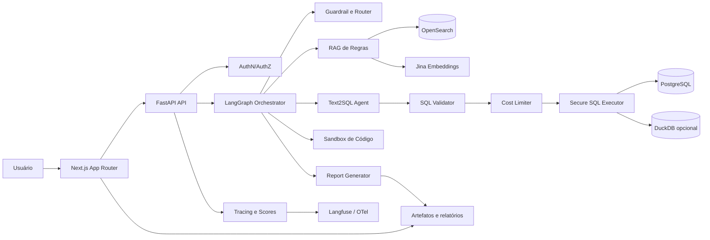
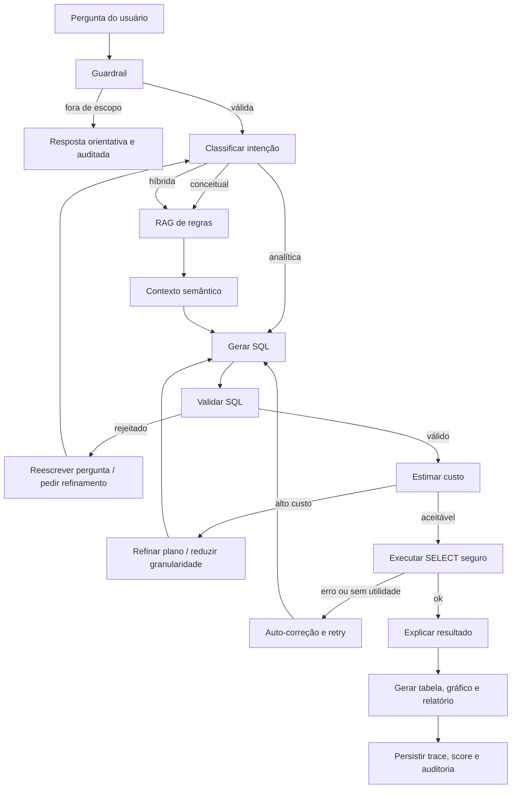

# Plataforma agentic analytics governada para pricing, margem, safra, risco e ROAE

## Resumo executivo

A síntese mais robusta dos repositórios fornecidos é que eles resolvem peças diferentes do mesmo problema. O **production-agentic-rag-course** entrega a fundação de retrieval e serving em produção: OpenSearch e BM25 na Week 3, chunking e hybrid search com Jina na Week 4, RAG completo com Ollama e streaming na Week 5 e um loop agentic com LangGraph, guardrail, reescrita de consulta e transparência de raciocínio na Week 7. O **text2sql-framework** entrega um núcleo forte para o mundo estruturado: o agente explora schema, executa SQL, lê erros, se autocorrige e usa `scenarios.md` como camada semântica leve. O **LangAlpha** mostra como isso evolui para produto: workspaces persistentes, `agent.md`, execução programática em sandbox, subagentes, skills e frontend orientado a artefatos. A proposta mais adequada para o seu caso não é “RAG puro”, mas uma **plataforma híbrida**: RAG para regras e glossário, Text-to-SQL para fatos, LangGraph para decisão e sandbox para análises e relatórios. citeturn12view2turn2view1turn2view5turn3view0turn20view0turn13view0turn13view1turn13view5

Para o caso de uso de **pricing/margem/safra/risco/ROAE**, a pergunta de negócio quase nunca é só textual nem só tabular. Em geral, ela combina semântica, regra, cálculo e evidência: “o que significa alto risco?”, “qual segmento teve pior margem na última safra?”, “a queda de ROAE decorre de mix, custo ou risco?”, “gere um diagnóstico executivo com rastreabilidade”. Isso exige um backend que saiba quando responder com documentação, quando consultar dados estruturados, quando juntar os dois e quando bloquear. O padrão do Week 7 é especialmente útil aqui, porque o fluxo deixa de ser “sempre recuperar e responder” e passa a ser “validar escopo, recuperar, avaliar, reescrever e tentar de novo”. citeturn3view0turn3view1turn3view2turn3view4

A arquitetura recomendada para o MVP é: **Next.js App Router** no frontend, **FastAPI** no backend, **LangGraph** para orquestração stateful, **TextSQL** como motor analítico, **OpenSearch** para o RAG de regras, **PostgreSQL** como banco factual e trilha de auditoria, **DuckDB** para desenvolvimento local e datasets de demo, **Ollama** para inferência local, **Jina** para embeddings e um **sandbox** para Python/SQL e geração de artefatos. Essa combinação é tecnicamente coerente com o ecossistema dos repositórios e com as capacidades oficiais dessas ferramentas: Next.js App Router usa Server Components, Suspense e Server Functions; FastAPI gera OpenAPI e documentação interativa automaticamente; LangGraph privilegia execução durável, memória e human-in-the-loop; OpenSearch oferece `knn_vector` com `index.knn=true`; DuckDB é um banco analítico embutido; e Ollama expõe API local estável com streaming e saída estruturada em JSON/JSON schema. citeturn26view0turn27view0turn27view1turn23view0turn23view1turn24view2turn25view0turn9search0turn9search1turn9search5

O maior cuidado do projeto deve ser **segurança e governança**. O text2sql-framework mostra que um agente com `execute_sql` pode atingir desempenho alto com pouquíssimo contexto, mas isso não significa que ele deva operar sem restrições em ambiente corporativo. Para dados de pricing e risco, o desenho seguro precisa impor whitelist de tabelas, classificação de sensibilidade, validação sintática e semântica de SQL, masking, limites de custo, timeout, auditoria e, em casos sensíveis, human-in-the-loop. O próprio LangAlpha é uma boa referência porque adota sandbox, redaction de segredos e cofre por workspace; e o PostgreSQL oferece Row Level Security por política. citeturn20view0turn20view4turn28view0turn28view1turn10search0turn10search2

O seu pedido de “pesquisar coisas adicionais que gerem valor e melhorem o sistema de avaliação, sempre com teste para verificar que nada está errado” muda a recomendação final: além do MVP funcional, o projeto deve nascer com um **sistema de qualidade contínua**. O núcleo recomendado é combinar **Langfuse** para datasets, traces, scores e experimentos; **Ragas** para métricas de RAG e SQL; **Promptfoo** para red teaming e testes adversariais; **dbt data tests e unit tests** para qualidade dos modelos analíticos; **Hypothesis** para property-based testing; **Schemathesis** para fuzzing de OpenAPI; **SQLGlot** para AST e validação estrutural de SQL; **SQLFluff** para linting em CI; **Pytest** para backend e **Playwright** para E2E; e **GitHub Actions** com matriz de jobs para impedir regressão em múltiplos ambientes. Isso transforma a banca de “demonstração de IA” em “demonstração de engenharia de produto confiável”. citeturn22search0turn22search1turn22search3turn15view0turn15view2turn15view1turn15view4turn15view5turn17search0turn17search1turn16search0turn16search1turn14search0turn14search1turn18search0

Alguns itens seguem **não especificados** e devem ser assumidos como parâmetros de implantação, não como fatos já decididos: provedor de cloud, identidade/autenticação, SLA, volume transacional, requisitos formais de LGPD/compliance, provedor principal de LLM em produção, política de retenção de logs, separação de ambientes e catálogo corporativo existente. Onde isso muda o desenho, o relatório abaixo adota defaults conservadores e marca o ponto como configurável.

## Lições das referências e decisões de projeto

O **production-agentic-rag-course** ensina uma progressão que vale reaproveitar quase integralmente. Na Week 3, a tese é “keyword search first”: integrar FastAPI, PostgreSQL e OpenSearch, criar índice com mapeamentos adequados, transferir dados do PostgreSQL para OpenSearch e expor endpoints de busca com BM25. Na Week 4, a semântica entra por chunking orientado por seções, embeddings Jina e busca híbrida em um índice unificado. Na Week 5, retrieval e LLM se unem em um RAG completo com endpoints padrão e streaming. Na Week 7, o sistema deixa de ser linear e vira um workflow stateful com guardrail, gradação de documentos, query rewriting, retries e campos explícitos de raciocínio. Essa progressão é exatamente a melhor forma de vender o seu projeto para a banca: do retrieval básico, à semântica, à geração, ao agente governado. citeturn1view0turn4view0turn4view2turn2view5turn3view0turn3view4turn19view0

Alguns detalhes dos notebooks fornecem defaults úteis para o MVP. A Week 4 compara overlaps de `0`, `50`, `100` e `150` palavras e recomenda **100 palavras** como melhor equilíbrio; ela também usa `target_words=600` no chunking e demonstra uma fusão híbrida simples de **60% BM25 + 40% vector**. O README do repositório, porém, descreve a Week 4 em termos de **RRF fusion**. A melhor leitura é tratar isso como um ponto de parametrização: o curso oferece duas pistas válidas — uma de conceito e outra de implementação demonstrada — então seu MVP deve suportar, no mínimo, uma estratégia linear ponderada e uma estratégia RRF, ambas sob suíte de benchmark interna. citeturn2view0turn2view1turn12view2

Há um detalhe adicional que gera valor técnico imediato: no notebook da Week 4, o exemplo de geração de embeddings mostra chamadas Jina com `task: "retrieval.passage"`. Já a documentação oficial da Jina recomenda **`retrieval.query` para consultas** e **`retrieval.passage` para documentos pesquisáveis**. Portanto, um ganho fácil e testável para o seu sistema é **separar o encoder de query do encoder de passage**, comparar `Recall@k` e freezing esse comportamento em testes de regressão. Esse é um ponto de melhoria real sobre o material-base, não apenas uma reembalagem. citeturn21view0turn8search4

Outro ponto que deve entrar no relatório como aprendizado de governança é que o raw notebook da Week 4 contém uma **string de API key da Jina diretamente no código do notebook**, o que é um anti-pattern claro de segurança. A implicação prática para o seu projeto é objetiva: adote varredura de segredos em CI, bloqueio de credenciais em notebooks e hooks de pre-commit. Além do risco de vazamento, isso é ótimo material para a banca, porque mostra maturidade de engenharia e não apenas ambição de IA. citeturn4view4

O **text2sql-framework** é a referência mais alinhada ao seu domínio porque modela o mundo estruturado de forma realista. O agente vê o banco como espaço de descoberta: explora schema, escolhe tabelas, executa SQL, observa erro e corrige. O README oficial explicita que schema retrieval e SQL generation acontecem “no mesmo loop”, que o agente pode trabalhar “out of the box” com apenas uma connection string e que `scenarios.md` injeta semântica que schema sozinho não explica. O framework também expõe `trace_file`, um loop de autoaprendizado por MCP para melhorar `scenarios.md` e uma arquitetura interna separando API pública, geração, conexão, ferramentas, dialetos, exemplos e tracing. Para pricing, isso é quase um molde natural: regras como “alto risco”, “última safra”, “margem líquida” e “ROAE” cabem muito bem em cenários desse tipo. citeturn12view0turn20view0turn20view2turn20view3turn20view4turn20view5

O **LangAlpha** acrescenta a dimensão de produto. Ele usa **React 19/Vite/Tailwind**, **FastAPI**, **PostgreSQL**, **Redis** e **Daytona**; introduz **Programmatic Tool Calling**, em que o agente escreve e executa Python para processar dados antes de devolvê-los ao modelo; mantém **workspaces persistentes** com `agent.md`; despacha **subagentes paralelos** via `Task()`; e traz **skills** e **frontend de workbench**. Para o seu caso, a principal lição não é copiar a stack, mas copiar a lógica de produto: persistência de contexto, artefatos, trabalho incremental, isolamento de execução e capacidade de revisão posterior. citeturn13view4turn13view0turn13view1turn13view5turn13view2

Há ainda duas camadas adicionais de valor que melhoram bastante o sistema. A primeira vem do próprio **Week 6** do mesmo curso: mesmo não tendo sido um dos notebooks explicitamente listados, o repositório oficial posiciona Week 6 como “production monitoring and caching”, com Langfuse para tracing end-to-end, Redis para cache e análise de custo/latência. Como você pediu “coisas adicionais que gerem valor”, esse material adjacente do mesmo repositório deve entrar no projeto como requisito de confiabilidade, não como opcional tardio. A segunda é que o próprio LangAlpha avisa que uma execução puramente em Docker com sandbox local é funcional, mas tem **segurança e isolamento inferiores** ao setup completo com Daytona; portanto, se o projeto for avaliado só em ambiente local, isso deve aparecer explicitamente como limitação arquitetural do MVP. citeturn19view0turn28view2turn28view3

A tabela a seguir condensa os trade-offs técnicos do trio “RAG documental, Text-to-SQL, referência LangAlpha” já traduzidos para o seu caso.

| Abordagem | Melhor uso | Força principal | Fragilidade principal | Papel recomendado |
|---|---|---|---|---|
| RAG de regras | glossário, política comercial, definição de ROAE, regras de risco, interpretação de safra | explica semântica e traz evidência textual | não responde bem a fatos tabulares e agregações | camada semântica e justificativa |
| Text-to-SQL agent | comparação por segmento/produto/safra, cortes de margem, ROAE, risco, inadimplência | responde fatos diretamente da base | sem controle, pode errar custo, schema ou privacidade | motor factual principal |
| Padrão LangAlpha | workspaces, relatórios, dashboards, continuidade analítica, subagentes | transforma POC em produto | aumenta escopo, superfície operacional e esforço | norte de evolução de produto |
| Agentic loop estilo Week 7 | roteamento, guardrails, retries, transparência | aumenta confiança operacional | exige estado e observabilidade bem modelados | camada de decisão e governança |

A recomendação final derivada dessas referências é objetiva: **MVP = RAG de regras + Text-to-SQL + guardrails + auditoria**; **produto = isso + workspaces + sandbox + skills + subagentes + experimentação contínua**. citeturn3view0turn20view0turn13view6

## Arquitetura alvo do MVP ao produto

O projeto deve ser apresentado à banca como uma **plataforma analítica conversacional governada**, não como um chatbot. O usuário faz uma pergunta; o sistema avalia escopo, sensibilidade e intenção; consulta regras, se necessário; produz e valida SQL quando a pergunta é factual; executa em ambiente seguro; explica o resultado em linguagem de negócio; salva trace, fonte, SQL e artefatos. Esse desenho combina com as capacidades do LangGraph — stateful, de longa duração, com durable execution e human-in-the-loop — e evita o maior erro em projetos desse tipo: tratar toda pergunta como “mensagem para um LLM”. citeturn23view0turn23view1turn23view2

A escolha de **Next.js App Router** para o frontend, em vez de replicar React/Vite como no LangAlpha, é uma decisão de produto. Os docs oficiais descrevem o App Router como file-system based, apoiado em Server Components, Suspense e Server Functions; e a documentação geral de Next.js o posiciona como framework full-stack para web apps. Para banca e para implementação assistida por agentes de coding, isso simplifica layout, rotas, middleware, rendering e integração com APIs. citeturn26view0turn26view1

A escolha de **FastAPI** para o backend também é natural. O framework valida corpo e parâmetros, converte JSON automaticamente, gera OpenAPI, expõe `/docs`, `/redoc` e `openapi.json`, suporta dependências, CORS, WebSockets e testes com HTTPX/pytest. Isso é especialmente útil no seu projeto porque a OpenAPI gerada serve não só ao time humano, mas também à suíte automatizada, ao frontend e a ferramentas de fuzzing baseadas em schema. citeturn27view0turn27view1

A camada de busca documental deve usar **OpenSearch** por aderência direta ao curso e porque o motor cobre tanto texto quanto vetores. A documentação oficial exige `index.knn=true` para busca vetorial e campos `knn_vector`, além de permitir ajuste de método, engine, modo de armazenamento e transporte. Para throughput futuro, a própria documentação recomenda considerar a **gRPC KNN API** para menor latência e maior throughput em aplicações vetoriais intensivas. No MVP, HTTP/REST é suficiente; no produto, gRPC vale como otimização previsível. citeturn24view2turn24view1

Para dados estruturados, a recomendação arquitetural é **PostgreSQL em produção** e **DuckDB no desenvolvimento/demo/testes**. O PostgreSQL traz maturidade transacional, políticas e auditoria; o DuckDB, por sua vez, roda “onde os dados estão”, lê arquivos e formatos analíticos diretamente, é portátil, rápido e muito conveniente para seeds e replay local. Essa dupla reduz atrito do MVP sem obrigar a arquitetura a ficar “presa” ao banco embutido. citeturn10search0turn10search2turn25view0

A arquitetura abaixo traduz essa síntese numa topologia implementável.

O diagrama mermaid a seguir consolida o desenho recomendado, alinhando LangGraph como runtime stateful, OpenSearch para regras, PostgreSQL/DuckDB para fatos, Ollama/Jina para inferência/embeddings e sandbox para artefatos, como sugerem o curso, o text2sql-framework e o LangAlpha. citeturn19view0turn20view0turn13view0turn13view1



No nível de componentes, a responsabilidade recomendada é a seguinte.

| Componente | Responsabilidade | Observação de projeto |
|---|---|---|
| Next.js frontend | chat, filtros, histórico, streaming, SQL viewer, fontes, download de relatórios | App Router favorece rotas, layouts e UX full-stack |
| FastAPI backend | contratos de API, autenticação, rate limiting, tracing, composição de resposta | OpenAPI vira contrato e insumo de testes |
| LangGraph agent | guardrail, roteamento, retries, orchestration e reasoning steps | separar nós pequenos melhora resiliência e debug |
| Text2SQL agent | schema discovery, uso de cenários, proposta/correção de SQL | base no `execute_sql` loop do framework |
| OpenSearch | glossário, regras, política, fórmulas, FAQs, documentação | usar lexical + vetorial + híbrido |
| PostgreSQL | dados operacionais, auditoria, políticas e sessões | core factual em produção |
| DuckDB | seeds, desenvolvimento local, replay e benchmark | engine leve para demo e CI |
| Ollama | geração local, JSON schema, streaming | fallback/upgrade para provedor externo é configurável |
| Jina | embeddings de regras e catálogo | separar `retrieval.query` e `retrieval.passage` |
| Sandbox | Python/SQL/relatórios/gráficos | nível de isolamento depende do ambiente |

Os fluxos críticos de negócio precisam estar explícitos para a banca. O primeiro é **conceitual**: consulta → guardrail → RAG de regras → resposta com fontes. O segundo é **analítico**: consulta → guardrail → Text-to-SQL → validação → execução → explicação. O terceiro é **híbrido**: consulta → guardrail → RAG de regras → SQL → explicação conectando política e resultado. O quarto é **executivo**: qualquer um dos fluxos acima seguido por geração de artefato e auditoria. Esse desenho é diretamente inspirado na Week 7 e na forma como o LangAlpha trata artefatos e persistência. citeturn3view1turn3view4turn13view1turn13view6

O diagrama abaixo mostra o fluxo agentic proposto para o caso de analytics governado.

O desenho do fluxo agentic abaixo usa o padrão do Week 7 — guardrail, grading, rewrite, retry —, mas o estende para validação SQL, limite de custo, execução segura e geração de relatório, o que é consistente com a função do LangGraph como runtime para workflows stateful e de longa duração. citeturn3view1turn3view4turn23view0turn23view2



O modelo de dados do MVP deve separar fatos, semântica, operação e auditoria. Recomendo pelo menos as seguintes entidades.

| Entidade | Papel |
|---|---|
| `fact_pricing_snapshot` | fatos por safra, segmento, produto, cliente, margem, risco, ROAE |
| `dim_cliente` | atributos de cliente, rating, cluster, flags de sensibilidade |
| `dim_produto` | atributos de produto, família, garantia, prazo |
| `metric_catalog` | semântica de métricas, fórmula, owner, sensibilidade |
| `schema_catalog` | tabela, coluna, tipo, nome de negócio, role, classificação |
| `semantic_rule_docs` | documentos primários de regras e glossário |
| `semantic_rule_chunks` | chunks indexados no OpenSearch |
| `agent_sessions` | sessão, usuário, workspace, modelo, modo |
| `query_audit_log` | pergunta, rota, SQL, custo estimado, latência, masking, status |
| `report_artifacts` | PDFs, Markdown, XLSX, imagens e metadata |

Para a banca, o mais importante não é a quantidade de tabelas, mas a mensagem arquitetural: **semântica não fica escondida em prompt**, **fato não fica escondido em embeddings**, e **auditoria não fica ausente do produto**. Essa separação faz muita diferença para sustentação posterior. citeturn20view0turn28view1turn22search0

## Segurança, governança e confiabilidade

A governança do projeto deve ser tratada como um requisito de primeira classe. O PostgreSQL oferece **Row Level Security** por política; o LangGraph favorece human-in-the-loop; o LangAlpha mostra um bom padrão de cofre de segredos, redaction e sandbox; e a Week 7 do curso mostra que o sistema já deve nascer com guardrail, não ganhar guardrail depois. A proposta recomendada é combinar **RLS em nível de linha**, **views ou projections mascaradas em nível de coluna**, **validador AST de SQL**, **limite de custo** e **auditoria por trace**. citeturn10search0turn10search2turn23view0turn28view0turn3view1

Para o seu caso, a política mínima recomendada é a seguinte.

| Camada | Controle recomendado |
|---|---|
| Escopo | guardrail com score e classificação de intenção |
| Autorização | role por usuário/perfil e whitelist de tabelas |
| Granularidade | agregado por padrão; drill-down só quando permitido |
| Colunas sensíveis | masking, hashing, bucketização ou supressão |
| SQL | apenas `SELECT`; sem multi-statement; sem DDL/DML; sem chamadas externas |
| Custo | `LIMIT`, timeout, budget de linhas, filtro temporal obrigatório em tabelas grandes |
| Execução | usuário técnico com menor privilégio |
| Sandbox | filesystem e rede isolados; paths protegidos |
| Segredos | vault; nunca em prompt e nunca em notebook |
| Auditoria | `trace_id`, SQL final, colunas acessadas, decisão de masking, custo e resultado |

No caso de SQL, eu recomendo fortemente complementar regex e validação ad hoc com **SQLGlot**. O projeto oficial se descreve como parser, transpiler e optimizer SQL sem dependências, com suporte a múltiplos dialetos; isso o torna adequado para construir uma etapa que parseia a consulta em AST, verifica tipos de statement, detecta múltiplas statements, tabelas proibidas, joins indevidos ou ausência de `LIMIT`, e só então aprova a execução. Em paralelo, **SQLFluff** funciona bem como linter em CI para SQL estático do projeto e também para snapshots de SQL gerado que você queira promover a “query certificada”. citeturn16search0turn16search1turn16search5

O padrão de sandbox do LangAlpha também merece ser adaptado. O README oficial descreve execução isolada por workspace, detecção de vazamento de credenciais, redaction antes de saída para o LLM, proteção de paths internos e um cofre de segredos por workspace. Mesmo que o seu MVP não implemente tudo isso, a direção correta é clara: resultados de ferramentas devem passar por um **middleware de redaction**, segredos devem ficar em um **vault** e a execução de código deve ocorrer em ambiente isolado. O próprio LangAlpha registra que a alternativa “só Docker” funciona, mas tem isolamento inferior ao setup com Daytona; essa observação deve aparecer como limitação do MVP local. citeturn28view0turn28view1turn28view3

A observabilidade deve nascer integrada à governança. O Langfuse documenta tracing de chamadas LLM e não-LLM, sessões, score objects, datasets, experimentos e captura via SDK ou OpenTelemetry. Isso permite transformar cada pergunta do usuário em um registro auditável e também em um item de dataset para regressão futura. Ao invés de guardar só “logs”, o projeto passa a guardar **provas de comportamento**. citeturn22search0turn22search1turn22search3turn22search7turn22search8turn15view3

Um cuidado extra de confiabilidade é a **granularidade de nós do grafo**. A documentação do LangGraph deixa claro que durable execution faz checkpoint em fronteiras de nó e que nós menores melhoram resiliência, debug, observabilidade e testabilidade, com custo pequeno porque checkpoints podem ser assíncronos. Isso sustenta uma recomendação concreta para o seu projeto: **não** colocar guardrail, roteamento, recuperação de regra, geração SQL, validação e explicação dentro de um nó único “agent”. Cada etapa deve ser um nó distinto e testável. citeturn23view1turn23view2

## Avaliação, testes e sistema de qualidade

Se a ambição é “sempre ter teste para verificar que nada está errado”, a arquitetura precisa ter um **sistema de avaliação em camadas**. Não basta testar endpoint ou conferir se a demo roda. O sistema precisa medir separadamente qualidade do retrieval, qualidade do plano agentic, validade do SQL, segurança, utilidade da resposta e regressão entre versões. O curso já aponta esse caminho ao falar em precisão, recall, relevance scoring, tracing e caching; o salto agora é transformar isso em uma disciplina de produto. citeturn12view2turn19view0turn22search0

A recomendação central é montar um **evaluation stack** combinando ferramentas complementares. O quadro abaixo mostra o que cada uma resolve melhor.

| Camada de avaliação | Ferramenta principal | Uso recomendado |
|---|---|---|
| Observabilidade e datasets | Langfuse | trace, dataset, score, experimento, comparação de versões |
| Métricas de RAG e agentic | Ragas | context recall/precision, faithfulness, métricas SQL e geração de testsets |
| Segurança adversarial | Promptfoo | prompt injection, jailbreak, PII leak, tool misuse, rule violations |
| Qualidade de dados | dbt data tests + unit tests | integridade de marts, constraints, relações, enums, lógica de modelo |
| Teste unitário e integração | Pytest | parser, guardrail, masking, executor, APIs |
| E2E de interface | Playwright | jornada real do usuário, streaming, download, masking no frontend |
| Property-based testing | Hypothesis | invariantes de masking, cost limiter, normalização, roteamento |
| Fuzzing de API | Schemathesis | geração automática de casos a partir da OpenAPI do FastAPI |
| Lint e AST SQL | SQLFluff + SQLGlot | lint, parse, bloqueio estrutural e portabilidade de dialetos |
| CI/CD | GitHub Actions | gates, matriz de versões, relatórios e bloqueio de merge |

Essa pilha é bem fundamentada em fontes oficiais. O Langfuse oferece traces, scores, datasets e experimentos; o Ragas documenta métricas para RAG, SQL e testset generation inclusive para agents/tool use; o Promptfoo documenta red teaming para injeções, vazamento de PII, violações de regra e uso inseguro de ferramentas; o dbt define data tests como `SELECT`s que retornam linhas falhas e oferece também unit tests para lógica SQL; o Playwright recomenda o plugin oficial `pytest-playwright`; o Hypothesis é a biblioteca de property-based testing para Python; o Schemathesis gera casos automaticamente a partir do esquema OpenAPI/GraphQL; e o GitHub Actions oferece estratégia de matriz para múltiplas combinações de ambiente. citeturn22search0turn22search1turn22search8turn15view0turn15view2turn15view1turn15view4turn15view5turn14search0turn14search1turn17search0turn17search1turn18search0turn18search2

A suíte de métricas do projeto deve ser separada por domínio, para não misturar “o LLM falou bonito” com “o sistema está correto”. O scorecard recomendado é este.

| Domínio | Métrica | Meta MVP | Meta produto |
|---|---|---:|---:|
| Regras/RAG | Recall@5 | 0,80 | 0,90 |
| Regras/RAG | Precision@5 | 0,70 | 0,85 |
| Guardrail | classificação correta de intenção/escopo | 0,90 | 0,96 |
| Text-to-SQL | SQL sintaticamente válido | 0,90 | 0,97 |
| Text-to-SQL | execução correta em benchmark interno | 0,85 | 0,92 |
| Segurança | vazamentos em testes de PII | 0 | 0 |
| Segurança | queries bloqueadas indevidamente | < 5% | < 2% |
| Operação | P95 do endpoint analítico | ≤ 8s | ≤ 5s |
| Operação | custo médio por pergunta | medido e controlado | otimizado por tier |
| Produto | respostas com trace_id e auditoria | 100% | 100% |
| Produto | geração de artefato executivo | 70% | 90% |

As metas acima são **propostas de projeto**, não números herdados automaticamente dos repositórios. Elas precisam ser validadas por benchmark interno. O text2sql-framework mostra 95% zero-shot e 100% com cenário adicional em um recorte do Spider; o Week 5 mostra melhora de latência e streaming; e o Week 6 acrescenta tracing e cache; mas seu domínio, seus dados e seu governança layer são diferentes. citeturn12view0turn2view4turn19view0

### TDD por componente e fluxo crítico

A estratégia mais segura é usar **TDD por contrato de comportamento**. Cada componente recebe casos unitários, critérios de integração, abuso adversarial e cenários de aceitação. O objetivo não é testar implementação, mas garantir propriedades de negócio e segurança que não podem regredir.

| Componente | Testes obrigatórios | Aceite automatizado |
|---|---|---|
| Guardrail | fora de escopo, dentro do escopo, pergunta vaga, sensibilidade alta | `allowed`, `intent`, `score` coerentes |
| Router | conceitual, analítico, híbrido | `routed_path` correto |
| RAG de regras | chunking, ranking, deduplicação, filtros por vigência | fontes corretas e `recall@k` mínimo |
| Generator de SQL | agregação, filtros de safra, joins corretos, métricas do catálogo | SQL válido e resultado esperado |
| SQL validator | DDL, DML, multi-statement, CROSS JOIN indevido, falta de `LIMIT` | bloqueio antes da execução |
| Cost limiter | cardinalidade alta, full scan, ausência de filtro temporal | bloqueio ou rewrite |
| Masking | ids, categorias sensíveis, small-cell suppression | nenhum dado sensível cru vaza |
| Executor | apenas usuário least-privileged, timeout, cancelamento | sem escalonamento de permissão |
| Explainer | resposta conectada a regras e a resultado | sem alucinação factual grosseira |
| Report generator | PDF/Markdown/XLSX e metadata | artefato persistido e baixável |
| Auditoria | `trace_id`, SQL, fontes, tempo, usuário, masking | persistência total no log |
| Frontend | chat, streaming, fontes, viewer de SQL, download | jornada E2E concluída |

### Casos adicionais de alto valor para o sistema de avaliação

As pesquisas adicionais que mais melhoram seu sistema, com melhor relação valor/esforço, são estas:

| Melhoria | Valor | Como testar |
|---|---|---|
| Datasets vivos no Langfuse | transforma incidentes reais em regressão permanente | toda falha relevante vira item de dataset |
| Ragas em CI | mede regressão de retrieval/faithfulness/SQL | job diário e job por PR |
| Promptfoo red team | descobre bypass de guardrail e PII leakage | suíte noturna e antes de release |
| dbt tests no catálogo/marts | garante que o dado usado pelo agente não está quebrado | `dbt test` em CI e em carga diária |
| Hypothesis | encontra edge cases não antecipados | propriedade “nada sensível sai cru” |
| Schemathesis | usa a própria OpenAPI do FastAPI para achar bugs de borda | fuzzing automático por schema |
| SQLGlot AST | evita depender só de regex | comparar AST permitido vs bloqueado |
| GitHub Actions matrix | garante estabilidade em mais de um runtime | Python/Node/OS por matriz |
| secret scanning em CI | evita repetir o anti-pattern visto no notebook | pipeline falha em credencial detectada |

### Exemplos de testes

Os exemplos abaixo são uma base adequada para o repositório. Eles seguem ferramentas oficiais e cobrem exatamente os controles que você destacou: validação SQL, masking, limites de custo e tracing/auditoria. citeturn14search0turn14search1turn17search0turn17search1

#### Pytest unitário para validação SQL

```python
# tests/unit/test_sql_validator.py
from app.security.sql_validator import validate_sql

def test_bloqueia_ddl():
    verdict = validate_sql("DROP TABLE fact_pricing_snapshot;")
    assert verdict.allowed is False
    assert any("DROP" in reason for reason in verdict.reasons)

def test_bloqueia_multistatement():
    verdict = validate_sql("SELECT 1; DELETE FROM fact_pricing_snapshot;")
    assert verdict.allowed is False
    assert any("multiple statements" in reason.lower() for reason in verdict.reasons)

def test_bloqueia_select_sem_limit_em_tabela_grande():
    verdict = validate_sql("SELECT * FROM fact_pricing_snapshot")
    assert verdict.allowed is False
    assert verdict.rewrite_hint is not None

def test_permite_select_agregado():
    verdict = validate_sql("""
        SELECT safra, AVG(margem_liquida) AS margem_media
        FROM fact_pricing_snapshot
        WHERE safra = '2026-03'
        GROUP BY safra
        LIMIT 100
    """)
    assert verdict.allowed is True
```

#### Pytest unitário para masking

```python
# tests/unit/test_masking.py
from app.security.masking import apply_masking

def test_mascara_cliente_id():
    rows = [{"cliente_id": "12345678900", "margem_liquida": 12.3}]
    masked = apply_masking(rows, sensitive_fields={"cliente_id"})
    assert masked[0]["cliente_id"] != "12345678900"
    assert masked[0]["margem_liquida"] == 12.3

def test_small_cell_suppression():
    rows = [{"segmento": "VIP", "qtd_clientes": 2}]
    masked = apply_masking(rows, sensitive_fields=set(), suppression_threshold=5)
    assert masked[0]["qtd_clientes"] in ("<5", None)
```

#### Integração HTTP para fluxo híbrido

```python
# tests/integration/test_ask_analytics.py
import requests

BASE_URL = "http://localhost:8000"

def test_fluxo_hibrido_retornando_fontes_sql_e_trace():
    payload = {
        "question": "Explique a regra de alto risco e compare ROAE por safra",
        "workspace_id": "demo",
        "mode": "auto"
    }
    resp = requests.post(f"{BASE_URL}/api/v1/ask-analytics", json=payload, timeout=30)
    assert resp.status_code == 200

    data = resp.json()
    assert data["trace_id"]
    assert data["routed_path"] in {"hybrid", "analytics"}
    assert "reasoning_steps" in data
    assert "answer" in data
    assert "sources" in data
```

#### Property-based testing com Hypothesis

```python
# tests/property/test_masking_properties.py
from hypothesis import given, strategies as st
from app.security.masking import apply_masking

@given(st.text(min_size=1, max_size=32))
def test_masking_nunca_retorna_valor_original(secret_value):
    rows = [{"cliente_id": secret_value}]
    masked = apply_masking(rows, sensitive_fields={"cliente_id"})
    assert masked[0]["cliente_id"] != secret_value
```

#### Fuzzing de OpenAPI com Schemathesis

```python
# tests/api/test_openapi_fuzz.py
import schemathesis

schema = schemathesis.openapi.from_url("http://localhost:8000/openapi.json")

@schema.parametrize()
def test_api_contract(case):
    response = case.call()
    case.validate_response(response)
```

#### E2E com Playwright

```python
# tests/e2e/test_frontend_chat.py
from playwright.sync_api import Page, expect

def test_usuario_gera_relatorio(page: Page):
    page.goto("http://localhost:3000")
    page.get_by_placeholder("Pergunte sobre margem, safra, risco ou ROAE").fill(
        "Gere um diagnóstico executivo da margem por safra para clientes de alto risco"
    )
    page.get_by_role("button", name="Analisar").click()

    expect(page.get_by_text("Trace ID")).to_be_visible(timeout=20000)
    expect(page.get_by_text("SQL executado")).to_be_visible(timeout=20000)
    expect(page.get_by_text("Resumo executivo")).to_be_visible(timeout=20000)
    expect(page.get_by_role("button", name="Baixar relatório")).to_be_visible(timeout=20000)
```

### Critérios de aceitação automatizados

Os critérios abaixo devem existir como gates formais em CI:

| Critério | Regra |
|---|---|
| Nenhuma pergunta fora de escopo executa SQL | `retrieval_attempts=0` ou `sql=None` |
| Nenhuma query DDL/DML chega ao executor | 100% bloqueio |
| Nenhum identificador sensível cru aparece em payload de resposta | 100% bloqueio |
| Toda resposta aprovada possui `trace_id` | 100% |
| Toda resposta analítica aprovada possui SQL ou justificativa auditável de ausência | 100% |
| Toda alteração em prompts principais roda experimentos em dataset | obrigatório |
| Toda PR roda unit + integration + security + e2e smoke | obrigatório |
| Toda release roda red team e benchmark interno | obrigatório |

### Operação do sistema de avaliação

O desenho operacional recomendado é este: **Pytest/DBT/SQL lint** em toda PR; **Schemathesis e smoke E2E** em toda PR principal; **Ragas + Langfuse experiments** em PRs que alterem prompts, retrieval ou roteamento; **Promptfoo red team** em nightly e antes de release; e **benchmark ouro** em toda milestone. O GitHub Actions suporta matriz de execução para múltiplas versões e ambientes, o que ajuda a evitar regressões silenciosas em Python/Node/OS diferentes. citeturn18search0turn18search2turn18search5

## Plano de implementação e evolução

O MVP precisa ser pequeno o bastante para entregar, mas já organizado como base de produto. Por isso, a recomendação é um **monorepo** com `apps/web`, `apps/api`, `packages/agents`, `packages/prompts`, `packages/evals`, `infra`, `data` e `docs`. Esse formato conversa bem tanto com times humanos quanto com implementação assistida por agentes, porque deixa contratos, testes e pacotes mais explícitos. A própria documentação do FastAPI sugere um `entrypoint` em `pyproject.toml`; a do Next.js organiza convenções por arquivos; e o curso já trabalha com serviços bem separados. citeturn27view1turn26view0turn19view1

Uma decomposição realista de milestones é a seguinte.

| Milestone | Entrega | Saída verificável | Esforço estimado |
|---|---|---|---:|
| Fundação de monorepo | apps web/api, docker compose, envs, healthcheck, OpenAPI, frontend shell | stack sobe localmente | 40–60h |
| Dados e catálogo | seeds DuckDB/Postgres, schema catalog, metric catalog, docs de regras, indexação OpenSearch | datasets e índice prontos | 50–80h |
| Núcleo governado | guardrail, router, RAG de regras, Text-to-SQL, SQL validator, executor seguro | endpoint `/ask-analytics` funcional | 90–140h |
| UX e relatórios | chat, SQL viewer, fontes, trace panel, download de markdown/pdf/xlsx | demo E2E | 60–100h |
| Qualidade e segurança | masking, cost limiter, audit log, Langfuse, Ragas, Promptfoo, Playwright, Schemathesis | pipeline de qualidade | 80–130h |
| Evolução de produto | workspaces, `agent.md`, sandbox mais completo, skills, subagentes, agenda | versão produto inicial | 180–320h |

Em termos de capacidade, a estimativa mais defensável para banca é a de **equipe balanceada**: um perfil backend/agents, um perfil frontend e apoio parcial de data/QA. Nesse formato, o MVP fica entre **300 e 420 horas**, e a evolução para produto entre **650 e 900 horas**, dependendo da profundidade do sandbox, da qualidade do design system e do número de skills que você decidir implementar. Como infraestrutura e compliance estão não especificados, esses números devem ser apresentados como **ordem de grandeza**, não como cronograma fechado. citeturn13view2turn23view0

A evolução inspirada no LangAlpha pode — e deve — ser apresentada como roadmap em cinco fases.

| Fase | Objetivo | Capacidade principal |
|---|---|---|
| Fundamentos governados | responder com segurança e rastreabilidade | RAG de regras + Text-to-SQL + auditoria |
| Copilot analítico | melhorar utilidade e UX | chat, viewer de SQL, fontes, relatórios simples |
| Workspace persistente | acumular contexto e trabalho | histórico, `agent.md`, artefatos, notas |
| PTC e sandbox analítico | enriquecer diagnóstico | Python/SQL em sandbox, gráficos, decomposição de drivers |
| Skills e automações | virar produto | playbooks, agenda, subagentes, relatórios recorrentes |

Essa evolução segue o espírito do LangAlpha: partir de “uma resposta” e chegar a “um ambiente de trabalho persistente”. O README oficial sustenta isso ao enfatizar workspaces persistentes, `agent.md`, PTC, subagentes e skills. citeturn13view0turn13view1turn13view2turn13view5turn13view6

Os riscos principais do projeto e suas contenções são estes.

| Risco | Probabilidade | Impacto | Mitigação |
|---|---|---|---|
| SQL correto sintaticamente, mas semanticamente errado | média | alto | dataset ouro, cenários versionados, verificação por execução |
| Vazamento de dado sensível | baixa/média | crítico | masking obrigatório, AST validator, RLS, red team |
| Custo/latência altos | média | alto | cache, top-k restrito, streaming, budget guardrails |
| Drift em regras de negócio | alta | alto | versionamento de docs e vigência no índice |
| Dependência excessiva do modelo | média | alto | prompts versionados, experimentos, fallback por provider |
| Escopo inflado pelo “efeito LangAlpha” | alta | alto | separar MVP de roadmap de produto |
| Avaliação fraca ou enviesada | média | alto | misturar testes determinísticos, humanos e LLM-as-a-judge |
| Segurança de sandbox insuficiente em local | média | médio/alto | declarar limitação do MVP e isolar melhor em produto |

## Material pronto para banca

### Prompts prontos

Os prompts abaixo já estão adaptados para o seu domínio. A recomendação é rodá-los com **saída estruturada** sempre que possível, aproveitando que o Ollama aceita `format: "json"` ou JSON schema na API de geração. Isso ajuda enormemente guardrail, router e SQL generation. citeturn9search1

#### Guardrail

```text
Você é o guardrail de um sistema agentic analytics governado.

Domínio permitido:
pricing, margem, safra, risco, ROAE, inadimplência, rentabilidade, segmento,
produto, carteira, política comercial, regra de negócio, glossário e documentação relacionada.

Objetivo:
classificar a pergunta, detectar sensibilidade e decidir se o sistema pode seguir.

Regras:
- Se a pergunta estiver fora do domínio, retorne allowed=false.
- Se pedir ação destrutiva, extração massiva de dados sensíveis, burlar política,
  ou qualquer operação não autorizada, retorne allowed=false.
- Classifique intent como:
  - conceptual
  - analytics
  - hybrid
  - out_of_scope
- Dê score de 0 a 100.
- Sugira rewrite_suggestion apenas se a pergunta estiver válida, mas vaga.
- Nunca gere SQL.
- Nunca invente tabela ou coluna.

Saída JSON:
{
  "allowed": true,
  "score": 78,
  "intent": "hybrid",
  "sensitivity_flag": "medium",
  "rewrite_suggestion": null,
  "reason": "..."
}

Pergunta:
{{question}}
```

#### Query rewriting

```text
Você reescreve perguntas para aumentar a precisão de um sistema agentic analytics.

Objetivo:
- preservar a intenção do usuário;
- explicitar período, granularidade e dimensão quando houver ambiguidade;
- manter linguagem de negócio, sem inventar colunas físicas.

Regras:
- Se houver termo ambíguo como "última safra", "alto risco", "margem", "ROAE",
  reescreva de forma operacional sem alterar o significado.
- Não gere SQL.
- Não invente tabelas ou nomes de colunas.
- Seja curto.

Saída JSON:
{
  "rewritten_question": "...",
  "why": "...",
  "assumptions": ["..."]
}

Pergunta original:
{{question}}

Contexto:
{{guardrail_result}}
{{retrieval_feedback}}
```

#### Geração de SQL

```text
Você é um agente Text-to-SQL corporativo para analytics de pricing.

Objetivo:
gerar SQL somente leitura, seguro, auditável e alinhado ao schema_catalog e aos scenarios.

Regras:
- Use apenas tabelas e colunas autorizadas.
- Priorize resultados agregados.
- Inclua LIMIT quando aplicável.
- Se a granularidade solicitada for sensível e a política não permitir, bloqueie.
- Nunca use DDL, DML, procedures, COPY, UNLOAD, múltiplas statements.
- Quando a pergunta citar "última safra", prefira a lógica definida em scenarios.
- Quando a pergunta citar "alto risco", consulte primeiro scenarios ou rag_context.

Saída JSON:
{
  "decision": "sql|needs_rule_context|blocked|clarify",
  "sql": "...",
  "tables_used": ["..."],
  "columns_used": ["..."],
  "estimated_granularity": "aggregated|customer_level|unknown",
  "explanation": "...",
  "safety_notes": ["..."]
}

Pergunta:
{{question}}

Schema catalog:
{{schema_catalog}}

Scenarios:
{{scenarios}}

RAG context:
{{rag_context}}
```

#### Explicação do resultado

```text
Você é um analista sênior de pricing e risco.

Sua tarefa é transformar o resultado da consulta em uma explicação executiva em português do Brasil.

Estrutura obrigatória:
1. resumo executivo
2. leitura analítica
3. riscos e limitações
4. próximos passos sugeridos

Regras:
- Comece pelo insight principal.
- Não invente causalidade além do que o resultado suporta.
- Se houver regra de negócio recuperada, conecte-a ao achado.
- Se houver mascaramento ou agregação, diga explicitamente.
- Se o resultado estiver vazio, explique e sugira hipóteses operacionais.

Entradas:
Pergunta: {{question}}
SQL: {{sql}}
Resultado: {{result_rows}}
Contexto semântico: {{rag_context}}
Notas de segurança: {{safety_notes}}
```

### Template de README

O template abaixo é o formato recomendado para entregar o projeto a avaliadores, equipe e agentes de implementação, mantendo rastreabilidade entre produto, arquitetura, segurança e testes. Ele reflete a estrutura que FastAPI, Next.js, o curso e o text2sql-framework tornam natural: app web, app API, contratos, docs e testes automatizados. citeturn26view1turn27view1turn20view3

```markdown
# Agentic Analytics para Pricing

## Visão geral
Plataforma analítica conversacional governada para perguntas de pricing,
margem, safra, risco e ROAE.

## Problema de negócio
Descreva o custo atual da análise manual, inconsistência semântica e baixa rastreabilidade.

## Objetivos
- Explicar regras de negócio
- Consultar dados estruturados com segurança
- Gerar respostas auditáveis e relatórios executivos

## Arquitetura
- Frontend: Next.js App Router
- Backend: FastAPI
- Orquestração: LangGraph
- SQL Agent: Text2SQL
- RAG: OpenSearch + Jina
- Banco: PostgreSQL / DuckDB
- LLM: Ollama / provider externo opcional
- Sandbox: execução isolada de código

## Fluxo principal
Pergunta → Guardrail → RAG de regras → Text-to-SQL → Executor seguro → Explicação → Relatório → Auditoria

## Estrutura do repositório
/apps
/packages
/infra
/data
/docs
/tests

## Como subir o ambiente
### Pré-requisitos
### Variáveis de ambiente
### Docker Compose
### Backend
### Frontend

## Endpoints
- POST /api/v1/ask-analytics
- POST /api/v1/search-rules
- GET /api/v1/health
- GET /api/v1/traces/{trace_id}

## Segurança e governança
Explique whitelist, masking, custo, auditoria, traces e red team.

## Avaliação e testes
- unitários
- integração
- E2E
- segurança
- RAG evals
- SQL evals
- prompt regressions

## Demo
Inclua roteiro, perguntas e critérios de sucesso.

## Roadmap
Fundamentos → workspace → sandbox → skills → automações

## Limitações
Liste itens não especificados e restrições do MVP.

## Licença
## Créditos
```

### Estrutura de slides para a banca

A banca é mista — técnica e de negócio —, então a apresentação deve alternar “por que isso importa” e “por que isso é confiável”. O roteiro abaixo faz essa costura.

| Slide | Título | O que mostrar |
|---|---|---|
| abertura | Problema e tese | lacuna entre regra e fato; por que agentic analytics |
| contexto | Dor atual | análise manual, demora, inconsistência, falta de rastreio |
| objetivo | O que o projeto resolve | pricing, margem, safra, risco, ROAE |
| referências | Bases utilizadas | course + text2sql + LangAlpha |
| proposta | Visão do sistema | RAG de regras + Text-to-SQL + agente + relatório |
| arquitetura | Diagrama principal | componentes e contratos |
| governança | Segurança | whitelist, masking, validação SQL, auditoria |
| fluxo | Jornada de uma pergunta | exemplo híbrido ponta a ponta |
| modelo de dados | Estrutura | fatos, catálogo, docs, auditoria |
| avaliação | Como sei que está certo | métricas, TDD, datasets, red team |
| demo | Cenário ao vivo | pergunta, fontes, SQL, resposta, relatório |
| roadmap | MVP → produto | fases 1–5 |
| esforço | Plano de execução | milestones, horas e equipe |
| riscos | O que pode falhar | risco + mitigação |
| fechamento | Valor final | ganho de negócio + confiança técnica |

### Roteiro de demo

```bash
# subir infra
docker compose up --build -d

# backend
uv run uvicorn app.main:app --reload --port 8000

# frontend
pnpm install
pnpm dev

# testes essenciais antes da demo
pytest -q tests/unit
pytest -q tests/integration
pytest -q tests/security
pytest -q tests/e2e
```

A ordem ideal da demo é esta.

| Etapa | Objetivo |
|---|---|
| abrir home | mostrar UX e framing do produto |
| pergunta conceitual | provar uso do RAG |
| resposta com fontes | provar rastreabilidade |
| pergunta analítica | provar Text-to-SQL |
| exibir SQL | provar auditabilidade |
| pergunta híbrida | provar orquestração agentic |
| mostrar trace_id | provar observabilidade |
| mostrar masking | provar governança |
| baixar relatório | provar valor executivo |

Perguntas de demonstração recomendadas:

```text
O que significa safra nesta base?
Qual segmento teve pior margem na última safra?
Quais produtos tiveram pior ROAE na safra mais recente?
Explique a regra de alto risco e compare inadimplência por safra.
Gere um diagnóstico executivo da queda de margem da safra 2026-03.
```

### Checklist de entrega para a banca

| Item | Status esperado |
|---|---|
| Resumo executivo fechado | pronto |
| Arquitetura em mermaid atualizada | pronto |
| Fluxo agentic documentado | pronto |
| Modelo de dados apresentado | pronto |
| Prompts versionados | pronto |
| SQL validator demonstrado | pronto |
| Masking demonstrado | pronto |
| Trace e auditoria demonstrados | pronto |
| Suite unitária rodando | pronto |
| Suite de integração rodando | pronto |
| Suite de segurança rodando | pronto |
| Smoke E2E rodando | pronto |
| Red team básico executado | pronto |
| README finalizado | pronto |
| Slides finalizados | pronto |
| Script de demo ensaiado | pronto |
| Riscos e limitações declarados | pronto |
| Itens não especificados declarados | pronto |

### Handoff recomendado para implementação por agentes

Para reduzir ambiguidade e facilitar implementação assistida por agentes de coding, eu recomendo entregar o repositório com a seguinte camada documental.

| Arquivo | Papel |
|---|---|
| `AGENTS.md` | instruções de implementação, convenções e limites |
| `ARCHITECTURE.md` | arquitetura, contratos e ADRs |
| `PROMPTS.md` | prompts versionados e critérios de mudança |
| `SCENARIOS.md` | regras semânticas do Text-to-SQL |
| `SECURITY.md` | políticas de SQL, masking, custo e auditoria |
| `EVALS.md` | benchmark interno, datasets e metas |
| `DEMO.md` | roteiro exato de demonstração |
| `README.md` | onboarding geral |
| `slides_banca.md` | narrativa executiva da apresentação |

A conclusão mais importante para a banca é esta: o projeto fica forte quando é apresentado como **um sistema agentic analytics governado, testado e auditável**, e não como um “chat com banco”. O trio de referências que você trouxe aponta exatamente nessa direção: o curso dá retrieval, API e agentic loop; o text2sql-framework dá o motor factual e o mecanismo de aprendizado via cenários; e o LangAlpha mostra o que vem depois, quando a POC precisa virar produto. Se você acrescentar a camada extra de avaliação contínua — Langfuse, Ragas, Promptfoo, dbt, Hypothesis, Schemathesis, SQLGlot, SQLFluff e CI com matriz —, o discurso da banca deixa de ser “isso parece promissor” e passa a ser “isso parece construível, governável e confiável”. citeturn19view0turn20view0turn13view6turn22search0turn15view0turn15view1turn15view4turn17search0turn17search1turn16search0turn16search1turn18search0