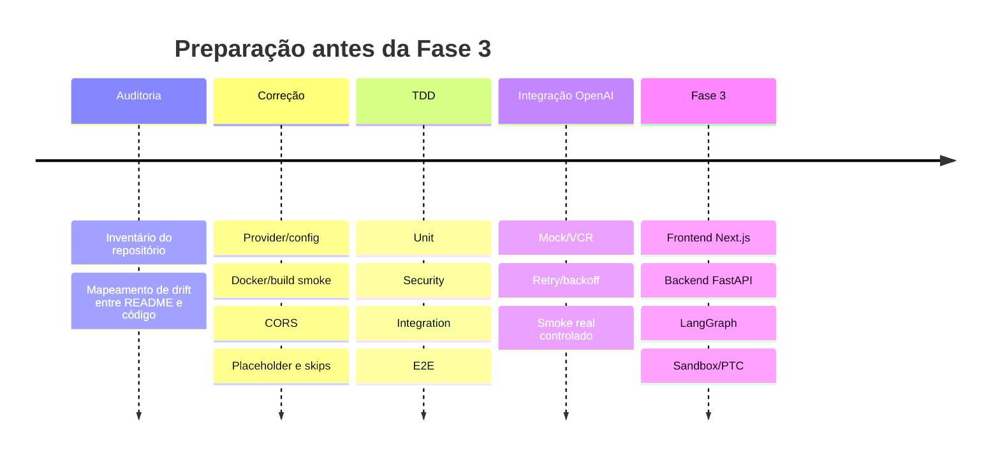

# Plano de validação e TDD para o Data Master IA antes da Fase 3

## Resumo executivo

A inspeção do repositório mostra uma base técnica promissora: há um backend FastAPI com rotas de saúde, consulta agentic, busca RAG, traço de auditoria e workspaces; um frontend Next.js com `ChatPanel`, `WorkspaceSidebar` e `ArtifactViewer`; uma árvore de agentes com `LangGraph`, `guardrail`, `text2sql`, `orchestrator`, especialistas e sandbox; além de infraestrutura com OpenSearch, PostgreSQL, Ollama, API e frontend via Docker Compose. Também já existe uma organização de testes por camadas no backend (`unit`, `security`, `integration`, `e2e`, `evals`) e Jest/RTL no frontend. citeturn26view0turn17view0turn20view0turn24view0turn10view2turn8view0turn16view0

O ponto crítico é que a implementação atual ainda mistura partes “quase-produto” com partes claramente provisórias. `Workspace` e `Thread` são mantidos em memória, não em banco; Redis não aparece na infraestrutura inspecionada; o sandbox atual é um subprocesso Python local com timeout, redaction e bloqueio parcial de variáveis de ambiente, mas sem isolamento explícito de rede ou filesystem; e o fluxo principal de LLM ainda está centrado em Ollama e heurísticas, apesar de `.env` e `Settings` exporem `OPENAI_API_KEY`. Além disso, o `docker-compose.yml` referencia Dockerfiles que não aparecem nas árvores de `apps/backend` e `apps/frontend` inspecionadas. citeturn22view3turn27view2turn10view2turn29view0turn10view1turn22view0turn28view1turn29view1turn5view0turn6view0

A confiança atual da suíte também não é alta o suficiente para autorizar a Fase 3 sem uma “Fase 2.5” de validação. Há testes úteis e bem direcionados, mas também há sinais de TDD em fase vermelha, casos E2E que fazem `skip` se o frontend não estiver no ar, e pelo menos um teste de segurança de frontend que hoje é apenas `assert True`. Em outras palavras: a estrutura de teste existe, mas ainda não é um gate confiável de qualidade. citeturn33view0turn14view3turn39view4turn39view0turn39view1turn39view2turn39view3

Minha recomendação é objetiva: **não liberar a Fase 3 ainda**. O passo correto agora é fechar um sprint de validação com TDD, corrigir contratos quebrados, endurecer o sandbox, introduzir uma camada formal para OpenAI como provider oficial, transformar testes de placeholder/skips em testes determinísticos e colocar CI/CD bloqueando merge. Isso reduz retrabalho justamente na etapa em que frontend Next.js, backend FastAPI, LangGraph, sandbox e provider LLM vão ficar mais acoplados. A abordagem é consistente com a forma como FastAPI, Next.js, Playwright, GitHub Actions e OpenAI documentam testes, integração e operação confiável. citeturn40search4turn41search2turn35search0turn41search0turn38search0turn34search0turn34search2

## Diagnóstico atual do repositório

A fotografia mais fiel do repositório é a de um **MVP avançado com evolução recente**, não a de um sistema integralmente endurecido para expansão. O README descreve fases amplas como concluídas, inclusive “100% de cobertura do caminho crítico”, frontend “premium”, E2E com Playwright e roadmap até a Fase 7; ao mesmo tempo, os arquivos inspecionados mostram provisórios importantes, como workspaces em memória, sandbox local simples, documentação da UI ainda parcialmente genérica e diferenças entre a documentação e o código efetivo. citeturn42view0turn22view3turn27view2turn29view0turn6view0

Também há drift de documentação/stack. O README e o documento de arquitetura falam em **Next.js 14**, mas o `package.json` do frontend inspecionado usa `next 16.2.6` e `react 19.2.4`. O README cita OpenAI como opcional, porém o fluxo inspecionado de guardrail e Text2SQL continua chamando Ollama ou fallback heurístico; não há uso visível do cliente oficial `openai-python` nos pontos principais analisados. citeturn42view0turn42view1turn11view0turn28view1turn29view1

### Checklist funcional de componentes

| Componente | Situação observada | Risco para a Fase 3 | Evidência |
|---|---|---|---|
| Frontend Next.js | Presente, com componentes principais e Jest/RTL | Médio | `package.json`, `src/components`, `src/__tests__` citeturn11view0turn17view0turn16view0 |
| Backend FastAPI | Presente, com rotas principais de API | Baixo | `main.py`, `api/v1` citeturn10view3turn26view0 |
| PostgreSQL | Presente no Compose e verificado no healthcheck | Médio | `docker-compose.yml`, `health.py` citeturn10view2turn22view1 |
| DuckDB | Usado como fallback para auditoria/traces | Médio | `traces.py`, `audit.py` citeturn27view1turn27view3 |
| OpenSearch | Presente em Compose, health e endpoint RAG | Baixo | `docker-compose.yml`, `health.py`, `search_rules.py` citeturn10view2turn22view1turn27view0 |
| Redis | Não especificado na infraestrutura inspecionada | Médio se houver SSE, filas ou buffer | `docker-compose.yml` citeturn10view2 |
| LangGraph / agentes | Estrutura presente, com graph, orchestrator e especialistas | Médio | `app/agent`, `specialists` citeturn20view0turn23view0 |
| Text2SQL | Presente, com prompt e validação AST | Médio | `text2sql_agent.py`, `sql_validator.py` citeturn29view1turn27view4 |
| Sandbox / PTC | Presente, mas local e parcial | Alto | `sandbox_executor.py` citeturn29view0 |
| Workspaces | API presente, persistência ainda em memória | Alto | `workspaces.py`, `workspace.py` citeturn22view3turn27view2 |
| Docker Compose | Presente, mas com risco de build | Alto | `docker-compose.yml`, árvores backend/frontend sem Dockerfile visível citeturn10view2turn5view0turn6view0 |
| `.env` / settings | Presente e razoavelmente organizado | Baixo | `.env.example`, `config.py` citeturn10view1turn22view0 |

### Testes existentes e os principais gaps

| Área | O que existe | Gap que reduz confiança | Evidência |
|---|---|---|---|
| Backend unit | Validador SQL, guardrail, masking, sandbox, workspace, agentes | Ainda precisa virar gate determinístico de execução real | `tests/unit` citeturn12view0turn39view0 |
| Backend integration | `ask-analytics`, auditoria, swarm, workspace API | Alguns fluxos ainda dependem de implementações provisórias | `tests/integration` citeturn13view1turn14view2turn39view1turn39view2 |
| Backend security | SQL injection dedicado | Falta gate completo de sandbox/network/PII na prática | `tests/security` citeturn13view0turn14view4 |
| Backend evals | Relevância de resposta e acurácia SQL | Há sinais de drift de schema de teste | `tests/evals` e `test_sql_accuracy.py` citeturn13view3turn39view3 |
| Backend E2E | Fluxo de chat Playwright e masking | Um teste faz `skip` se o frontend não estiver no ar e outro é placeholder | `test_frontend_chat.py`, `test_security_masking.py` citeturn14view3turn39view4 |
| Frontend unit | ChatPanel, SQLViewer, SourcesPanel, TracePanel, WorkspaceSidebar | Parte da suíte está em estilo TDD-RED e precisa estabilização | `src/__tests__` citeturn16view0turn33view0turn33view1 |

## Riscos e gaps críticos que precisam ser fechados

O primeiro bloqueio é de **contrato de configuração e provider**. `Settings` expõe `OLLAMA_HOST`, mas `Text2SQLAgent._call_llm()` monta a URL com `settings.OLLAMA_BASE_URL`, atributo que não aparece em `config.py`. Esse é um defeito de execução provável e deve virar um teste RED imediato. Somando a isso, embora `.env` e `Settings` exponham `OPENAI_API_KEY`, os agentes principais inspecionados usam Ollama ou fallback heurístico; o cliente oficial da OpenAI não aparece como provider explícito da aplicação. citeturn22view0turn10view1turn29view1turn28view1turn11view0

O segundo bloqueio é de **reprodutibilidade de dependências**. `sql_validator.py` depende de `sqlglot` para validação AST, mas `pyproject.toml` não o lista explicitamente entre as dependências diretas inspecionadas. Mesmo que `sqlglot` chegue por transitividade em algum ambiente, isso enfraquece reproducibilidade local, CI e build containerizado. citeturn27view4turn10view0

O terceiro bloqueio é **deploy e smoke local**. O `docker-compose.yml` define builds para backend e frontend com `dockerfile: Dockerfile`, mas nas árvores inspecionadas de `apps/backend` e `apps/frontend` esses Dockerfiles não aparecem. Isso não prova sozinho que o Compose quebrará, mas é um sinal forte de risco de falha em `docker compose up --build` até que o build path seja fechado e validado em CI. O próprio Docker documenta que `depends_on` e `healthcheck` são úteis para orquestrar startup, então o teste de smoke aqui precisa ser obrigatório. citeturn10view2turn5view0turn6view0turn35search1turn35search7

O quarto bloqueio é **CORS em ambiente real de navegador**. O `main.py` adiciona `CORSMiddleware` com `allow_origins` contendo `"*"`, `allow_methods=["*"]`, `allow_headers=["*"]` e `allow_credentials=True`. A documentação do FastAPI alerta que, com credenciais, não se deve usar curingas dessa forma. Isso precisa de correção e de um teste E2E real com navegador, não apenas de um unit test. citeturn10view3turn40search16

O quinto bloqueio é **persistência de workspaces**. A API de workspaces usa dicionários globais `_workspaces` e `_threads`, e os models são dataclasses em memória destinadas a “funcionar sem banco durante os testes”. Isso é ótimo para bootstrap, mas não valida a promessa de continuidade entre sessões nem prova integridade transacional. Além disso, esse tipo de estado global tende a vazar entre testes se não houver fixture de reset explícita. citeturn22view3turn27view2turn39view2

O sexto bloqueio é **isolamento real do sandbox**. O executor atual faz timeout, redaction e remove variáveis de ambiente sensíveis do processo filho, mas não mostra no código inspecionado qualquer política explícita de bloqueio de rede, chroot, jail de filesystem, seccomp, cgroup, namespaces ou sandbox externo. Isso contrasta com a expectativa dos testes, que citam bloqueio de `/etc/passwd`, imports perigosos e segurança forte. Em outras palavras: a intenção da suíte é mais forte do que a proteção visível na implementação. citeturn29view0turn39view0

O sétimo bloqueio é **confiabilidade da própria suíte**. `test_frontend_chat.py` faz `skip` se o frontend não estiver rodando; `test_security_masking.py` é placeholder; parte da suíte de frontend explicita “TDD — Fase RED”; e o avaliador SQL mostrado em `test_sql_accuracy.py` usa a tabela `pricing_data`, que não está entre as tabelas autorizadas no `sql_validator.py`. Isso pode gerar falso senso de segurança ou drift entre schema real e schema testado. citeturn14view3turn39view4turn33view0turn39view3turn27view4

### Plano de correção priorizado

| Prioridade | Correção | Esforço | Motivo |
|---|---|---|---|
| P0 | Corrigir contrato `OLLAMA_HOST` vs `OLLAMA_BASE_URL` e introduzir teste RED correspondente | Low | Defeito provável de runtime em Text2SQL |
| P0 | Adicionar dependência direta de `sqlglot` | Low | Reprodutibilidade de build e CI |
| P0 | Corrigir CORS para origens explícitas e validar em navegador | Low | Risco real de falha front→API |
| P0 | Remover `skip`/placeholder da suíte e criar ambiente E2E determinístico | Medium | Gate atual não prova funcionamento |
| P0 | Fechar estratégia de build Docker e adicionar smoke obrigatório | Medium | Fase 3 depende de execução local e CI previsível |
| P1 | Criar camada formal de provider LLM com OpenAI oficial + mocks + smoke real | Medium | Necessário para a próxima etapa |
| P1 | Persistir workspaces em PostgreSQL ou declarar modo efêmero oficialmente | Medium | Sem isso, continuidade de sessão não é comprovada |
| P1 | Endurecer sandbox com container/jail ou migrar para sandbox externo | High | Segurança do PTC antes de liberar artefatos ricos |
| P1 | Corrigir drift de schema/avatar nos evals e fixtures | Medium | Avaliações precisam refletir o schema real |
| P2 | Introduzir Redis apenas se Fase 3 realmente exigir SSE/buffer/fila | Medium/High | Hoje não é componente comprovadamente necessário no código inspecionado |

## Estratégia de validação e TDD

A próxima etapa deve seguir **TDD clássico**, mas com uma adaptação importante para sistemas agentic: **Red, Green, Refactor, e só então Expand**. Em outras palavras, antes de acrescentar novos recursos de Fase 3, cada componente atual precisa ganhar um contrato de comportamento executável. No backend síncrono e assíncrono, o stack recomendado é FastAPI `TestClient` para casos simples, `httpx.AsyncClient` para fluxos `async`, e `pytest-asyncio` para cenários assíncronos; no frontend, Next.js documenta Jest/RTL para unit tests e recomenda E2E para partes mais próximas do comportamento real da App Router; para browser E2E, Playwright recomenda priorizar locators baseados em papéis (`get_by_role`) por serem mais resilientes. citeturn40search4turn41search2turn36search0turn35search0turn41search0turn41search1turn36search15

Para endurecer o repositório, eu recomendo a seguinte pilha complementar: `vcrpy` e `requests-mock` para gravar/mocar chamadas HTTP em testes sem custo; `tenacity` para retries explícitos com backoff; `openai-python` como cliente oficial; `sqlfluff` como linter/formatter de SQL; `bandit` para segurança estática em Python; e `sqlparse` apenas como ferramenta auxiliar de parsing/normalização, nunca como barreira principal de segurança, já que o próprio repositório já toma a direção correta ao usar AST com `sqlglot`. citeturn36search1turn36search2turn36search3turn34search0turn36search4turn36search5turn36search14turn27view4

### Testes prioritários por impacto

| Teste | Impacto | Por que entra primeiro |
|---|---|---|
| Contrato de provider/configuração LLM | Muito alto | Evita quebra estrutural na integração OpenAI |
| Smoke de Docker/health | Muito alto | Garante ambiente reprodutível antes de expandir features |
| Sandbox isolation | Muito alto | Risco de segurança e vazamento |
| CORS real em navegador | Alto | Front e back já vão escalar juntos na Fase 3 |
| Workspace persistente | Alto | Sem isso, “pesquisa de longo prazo” fica falsa |
| SQL validator + injection | Alto | É a fronteira de segurança do produto |
| Masking de PII | Alto | Zero trust depende disso |
| E2E chat happy path | Alto | Valida a experiência mínima do produto |
| OpenAI mocked retry/backoff | Alto | Necessário para adoção do endpoint oficial |
| OpenAI live smoke | Médio/alto | Deve existir, mas fora do PR padrão |

### Conjunto inicial de casos de teste TDD

| ID | Objetivo | Tipo | Pré-condição | Passos | Critério de aceite |
|---|---|---|---|---|---|
| T01 | Garantir contrato correto de configuração LLM | Unit | `.env.test` carregado | Mockar chamada HTTP do Text2SQL; chamar `_call_llm()` | URL usa `OLLAMA_HOST` ou provider correto; sem `AttributeError` |
| T02 | Bloquear DDL/DML/multi-statement/UNION | Unit | Nenhuma dependência externa | Rodar `validate_sql()` com payloads maliciosos | Todos retornam `allowed=False` com motivo explícito |
| T03 | Mascarar campos sensíveis e expor `_masked_fields` | Unit | Resultado SQL fake com PII | Aplicar `apply_masking()` | Valores sensíveis não aparecem em claro |
| T04 | Impedir queries acima do orçamento de cardinalidade | Unit | Cost limiter ativo | Simular consulta acima do orçamento | Execução é bloqueada com mensagem auditável |
| T05 | Classificar perguntas in-scope/out-of-scope sem rede | Unit | Heurística ativa | Testar perguntas de pricing e fora do domínio | `intent` e `allowed` coerentes |
| T06 | Validar parse/fallback de Text2SQL | Unit | Prompt controlado | Injetar resposta JSON válida, inválida e vazia | Resultado final vira `sql`, `blocked` ou `clarify` corretamente |
| T07 | Redactar segredos no sandbox | Unit | Executor local | Imprimir `sk-...`, bearer token e base64 longa | Saída contém `[REDACTED]` |
| T08 | Bloquear escape de rede e filesystem no sandbox | Unit | Executor/sandbox configurado | Tentar `socket.create_connection()` e leitura de `/etc/passwd` | Execução falha sem dados sensíveis |
| T09 | Reportar health degradado quando dependência cair | Integration | API em modo teste | Mockar OpenSearch/Ollama/Postgres indisponíveis | `/api/v1/health` responde `degraded`, sem 500 genérico |
| T10 | Validar rota analytics completa | Integration | App FastAPI em memória | POST em `/ask-analytics` com pergunta quantitativa | Status 200, `trace_id`, `routed_path`, `sql` e resposta presentes |
| T11 | Validar rota conceptual/híbrida | Integration | App FastAPI em memória | POST em `/ask-analytics` com pergunta de glossário/regra | Status 200, `routed_path` esperado, `reasoning_steps` presentes |
| T12 | Validar CRUD de workspace e thread | Integration | Estado de teste limpo | Criar workspace; criar thread; atualizar `agent_md`; listar | IDs retornam, estado persiste durante o teste |
| T13 | Garantir routing do swarm | Integration | Orchestrator disponível | Pergunta que exige DataAgent + RiskAgent | Ambos são chamados e resposta final agrega os dois |
| T14 | Garantir auditoria com fallback | Integration | Postgres indisponível ou mockado | Persistir audit log | Entrada cai em DuckDB ou JSONL de fallback |
| T15 | OpenAI mocked: retry com 429/5xx | Integration | Provider OpenAI mockado | Simular sequência 429 → 200 | Retry/backoff acontece; resposta final é entregue |
| T16 | OpenAI live smoke com orçamento | Integration/Smoke | Secret real disponível | Enviar 2–3 prompts canônicos em workflow separado | Latência, status e uso dentro do orçamento definido |
| T17 | Docker Compose smoke | Smoke | Compose válido | Subir stack; esperar healthchecks | OpenSearch/Postgres/API/frontend ficam saudáveis |
| T18 | Frontend chat happy path | E2E Playwright | Frontend rodando; API mockada | Abrir home; enviar pergunta; receber resposta | Usuário vê resposta, SQL, trace e sem erro |
| T19 | Frontend workspace flow | E2E Playwright | API mockada com workspaces | Criar “Nova análise”, selecionar workspace, recarregar | Workspace ativo reaparece após reload |
| T20 | Segurança visual do frontend | E2E Playwright | Payload mockado com PII mascarada e artefatos | Renderizar resposta com PII/artefato/erro 429 | UI nunca exibe PII em claro, artefato renderiza, erro é amigável |

### Exemplos de testes propostos

O primeiro exemplo abaixo é propositalmente um teste **RED** para capturar o defeito de contrato que hoje parece existir entre `config.py` e `text2sql_agent.py`. O segundo fortalece sandbox. O terceiro segue o estilo existente com `playwright.sync_api`, mas usando locators mais resilientes, no espírito recomendado pela documentação do Playwright. citeturn22view0turn29view1turn29view0turn36search23turn41search1

```python
# apps/backend/tests/unit/test_text2sql_provider_contract.py
import pytest
from unittest.mock import AsyncMock, patch

from app.config import settings
from app.agent.text2sql_agent import Text2SQLAgent


@pytest.mark.asyncio
async def test_text2sql_usa_host_configurado_do_settings():
    agent = Text2SQLAgent()

    fake_response = AsyncMock()
    fake_response.raise_for_status.return_value = None
    fake_response.json.return_value = {"response": "{}"}

    with patch("httpx.AsyncClient.post", return_value=fake_response) as mocked_post:
        await agent._call_llm("teste controlado")
        called_url = mocked_post.await_args.args[0]
        assert called_url == f"{settings.OLLAMA_HOST}/api/generate"
```

```python
# apps/backend/tests/unit/test_sandbox_network_isolation.py
import pytest

from app.agent.tools.sandbox_executor import SandboxExecutor


@pytest.mark.asyncio
async def test_sandbox_nao_pode_abrir_socket_externo():
    sandbox = SandboxExecutor()
    code = """
import socket
socket.create_connection(("example.com", 80), timeout=2)
print("network-open")
"""
    result = await sandbox.execute(code, timeout_seconds=5)

    assert result.success is False
    assert "network-open" not in result.stdout
```

```python
# apps/backend/tests/e2e/test_frontend_chat_sync.py
import re
from playwright.sync_api import Page, expect


def test_chat_happy_path(page: Page):
    page.route(
        "**/api/v1/ask-analytics",
        lambda route: route.fulfill(
            status=200,
            json={
                "trace_id": "trace-123",
                "question": "Qual a margem por safra?",
                "answer": "A margem média da safra é 5%.",
                "routed_path": "analytics",
                "reasoning_steps": ["Guardrail ok", "SQL executado"],
                "retrieval_attempts": 1,
                "rewritten_query": None,
                "sources": [],
                "sql": "SELECT AVG(margem_liquida) FROM fact_pricing_snapshot LIMIT 1",
                "sql_result": [{"avg": 5.0}],
                "masked_fields": [],
                "artifacts": [],
                "sandbox_result": None,
                "specialist_messages": [],
                "latency_ms": 120,
                "status": "success",
            },
        ),
    )

    page.goto("http://localhost:3000")
    page.get_by_role("textbox").fill("Qual a margem por safra?")
    page.get_by_role("button", name=re.compile("Analisar|Enviar", re.I)).click()

    expect(page.get_by_text("A margem média da safra é 5%.")).to_be_visible()
    expect(page.get_by_text("trace-123")).to_be_visible()
    expect(page.get_by_text("SELECT AVG")).to_be_visible()
```

## Política para endpoint oficial OpenAI e opções de sandbox

A integração com o endpoint oficial deve usar o **cliente oficial `openai-python`** e a **Responses API** como contrato principal. O repositório já expõe `OPENAI_API_KEY` em `.env` e em `Settings`, mas os agentes centrais inspecionados ainda não o usam como provider explícito. Como o diretório `app/services` está praticamente vazio nos arquivos inspecionados, ele é o lugar natural para introduzir `llm_provider.py` ou `openai_client.py`, separando escolha de provider, retries, logging, orçamento e mocks do código dos agentes. citeturn34search0turn34search10turn34search14turn10view1turn22view0turn28view1turn29view1turn25view1

Para testes, a política ideal é separar **testes reais** e **testes simulados** por classe de risco. Em PR e CI padrão, o default deve ser **100% mockado** para OpenAI, usando `requests-mock` ou `VCR.py`; em nightly, um smoke mínimo com provider real; e em release candidate, uma suíte curtíssima com prompts fixos, modelo pinado, limites de tempo e orçamento habilitados. Isso é especialmente importante porque os erros 429 exigem backoff exponencial, e a cobrança da OpenAI é baseada em uso/token. citeturn36search1turn36search2turn36search3turn34search2turn34search3

### Política operacional para OpenAI

| Ambiente | Tipo de teste | Provider | Regra |
|---|---|---|---|
| PR | Unit/Integration | Mock/VCR | Nunca chamar endpoint real |
| Nightly | Smoke | OpenAI real | 2–3 prompts canônicos, modelo pinado, retry/backoff ativo |
| Release candidate | Smoke reforçado | OpenAI real | Mesmo conjunto do nightly + orçamento/custo estrito |
| Local dev | Opt-in | Mock por padrão, real sob flag | Evitar custo acidental |

Regras práticas que eu recomendo para a camada OpenAI:

1. **Pin de modelo por ambiente**, sem aliases “soltos”.
2. **Retries explícitos com Tenacity**, mesmo que a SDK já seja resiliente em alguns cenários; o objetivo aqui é centralizar política de produto, não depender de detalhe implícito. citeturn36search3turn34search2
3. **Tags de teste** como `@pytest.mark.live_openai` para impedir execução acidental.
4. **Orçamento por pipeline**, com falha se custo/uso da suíte ultrapassar teto acordado.
5. **Masking obrigatório antes do provider externo**, garantindo que a OpenAI nunca receba PII em claro quando a política do sistema não permitir. citeturn28view0turn42view0

### Ambientes de sandbox comparados

Como não há restrição de cloud provider, faz sentido manter uma opção local e uma opção serverless. O executor atual do repositório é bom como fallback de desenvolvimento, mas não deveria ser a principal barreira de segurança para código gerado por LLM em uma fase mais avançada. E2B e Daytona documentam sandboxes isolados e gerenciáveis programaticamente, o que os torna opções mais apropriadas para PTC real. citeturn29view0turn37search1turn37search21turn37search20turn37search8

| Opção | Isolamento | Facilidade para CI/POC | Quando usar |
|---|---|---|---|
| Subprocesso local atual | Baixo/Médio | Muito alta | Apenas fallback local e testes rápidos |
| Sandbox local com Docker/OCI | Médio/Alto | Alta | Default local recomendado antes da Fase 3 |
| E2B serverless | Alto | Muito alta | Hackathon, POC, smoke cloud |
| Daytona cloud/private | Alto | Alta | Ambientes mais estáveis, persistentes e com controle maior |

Minha recomendação prática é:

- **Curto prazo**: manter o executor atual só para dev/test rápido e introduzir testes RED que provem suas limitações.
- **Default para validação séria**: usar **sandbox local containerizado** em Docker Compose.
- **Opção cloud sem atrito**: **E2B**.
- **Opção cloud/private com maior controle**: **Daytona**. citeturn29view0turn37search1turn37search20

## CI, operação e critérios de bloqueio

Como os workflows não estão especificados nos arquivos inspecionados, o repositório precisa entrar em regime formal de CI agora. O GitHub exige workflows em `.github/workflows`, e branch protection pode exigir status checks específicos para bloquear merge. A documentação também recomenda manter nomes de jobs únicos quando eles forem checks obrigatórios. citeturn38search0turn38search1turn38search3turn38search12

### Comandos para rodar tudo localmente

Os comandos abaixo refletem o que o repositório já sugere, com alguns complementos necessários para a etapa de validação. O Docker Compose atual já sobe OpenSearch e PostgreSQL, e o README já usa `pytest` no backend e `npm/pnpm` no frontend; a diferença aqui é que eu estou transformando isso em rotina formal de validação. citeturn42view0turn10view2turn11view0

```bash
# raiz
cd agentic-analytics
cp .env.example .env

# infra mínima atual
cd infra
docker compose up -d opensearch postgres ollama
docker compose ps

# backend
cd ../apps/backend
uv venv
uv pip install -e ".[dev]"
python -m pytest tests/unit tests/security -v
python -m pytest tests/integration -v
python -m pytest tests/evals -v

# playwright python existente no backend
playwright install
python -m pytest tests/e2e -v

# frontend
cd ../frontend
pnpm install
pnpm test
pnpm build
pnpm dev
```

Quando os Dockerfiles forem adicionados ou confirmados, o smoke full-stack deve virar obrigatório:

```bash
cd agentic-analytics/infra
docker compose up -d --build
docker compose ps
docker compose logs --tail=200 api frontend opensearch postgres ollama
```

### Exemplo de workflow GitHub Actions

Abaixo está um exemplo de `ci.yml` pensado para o formato atual do monorepo. O job `live-openai-smoke` fica fora do PR padrão e só roda por agenda ou despacho manual. Os checks que eu marcaria como obrigatórios desde já seriam `backend-tests`, `frontend-tests`, `security-scan` e `infra-smoke`. citeturn38search0turn38search1turn38search11

```yaml
name: ci

on:
  pull_request:
  push:
    branches: [main]
  workflow_dispatch:
  schedule:
    - cron: "0 8 * * *"

jobs:
  backend-tests:
    name: backend-tests
    runs-on: ubuntu-latest
    defaults:
      run:
        working-directory: agentic-analytics/apps/backend
    steps:
      - uses: actions/checkout@v4

      - uses: actions/setup-python@v5
        with:
          python-version: "3.12"

      - name: Install backend
        run: |
          python -m pip install --upgrade pip
          pip install -e ".[dev]"
          pip install bandit sqlfluff tenacity vcrpy requests-mock openai

      - name: Run unit and security tests
        run: |
          pytest tests/unit tests/security -v --maxfail=1

      - name: Run integration tests
        run: |
          pytest tests/integration -v --maxfail=1

      - name: Run evals
        run: |
          pytest tests/evals -v --maxfail=1

  frontend-tests:
    name: frontend-tests
    runs-on: ubuntu-latest
    defaults:
      run:
        working-directory: agentic-analytics/apps/frontend
    steps:
      - uses: actions/checkout@v4

      - uses: actions/setup-node@v4
        with:
          node-version: "20"
          cache: "pnpm"
          cache-dependency-path: agentic-analytics/apps/frontend/pnpm-lock.yaml

      - name: Install pnpm
        run: npm install -g pnpm

      - name: Install frontend deps
        run: pnpm install --frozen-lockfile

      - name: Run frontend unit tests
        run: pnpm test

      - name: Build frontend
        run: pnpm build

  security-scan:
    name: security-scan
    runs-on: ubuntu-latest
    defaults:
      run:
        working-directory: agentic-analytics/apps/backend
    steps:
      - uses: actions/checkout@v4

      - uses: actions/setup-python@v5
        with:
          python-version: "3.12"

      - name: Install scanners
        run: |
          python -m pip install --upgrade pip
          pip install bandit sqlfluff

      - name: Bandit
        run: bandit -r app -ll

      - name: SQLFluff sanity
        run: |
          find app -name "*.py" -print

  infra-smoke:
    name: infra-smoke
    runs-on: ubuntu-latest
    defaults:
      run:
        working-directory: agentic-analytics/infra
    steps:
      - uses: actions/checkout@v4

      - name: Start infra
        run: docker compose up -d opensearch postgres ollama

      - name: Wait and inspect
        run: |
          sleep 20
          docker compose ps
          docker compose logs --tail=200 opensearch postgres ollama

  live-openai-smoke:
    name: live-openai-smoke
    if: github.event_name == 'schedule' || github.event_name == 'workflow_dispatch'
    runs-on: ubuntu-latest
    defaults:
      run:
        working-directory: agentic-analytics/apps/backend
    env:
      OPENAI_API_KEY: ${{ secrets.OPENAI_API_KEY }}
    steps:
      - uses: actions/checkout@v4

      - uses: actions/setup-python@v5
        with:
          python-version: "3.12"

      - name: Install backend + openai
        run: |
          python -m pip install --upgrade pip
          pip install -e ".[dev]" openai tenacity requests-mock vcrpy

      - name: Run live OpenAI smoke tests
        run: pytest -m live_openai -v --maxfail=1
```

### Critérios de bloqueio para CI/CD

Os gates que eu adotaria para bloquear merge são os seguintes:

| Check obrigatório | Critério |
|---|---|
| Backend unit + security | 100% green |
| Backend integration | 100% green |
| Frontend unit | 100% green |
| Build frontend | 100% green |
| Infra smoke | stack sobe e responde healthchecks |
| Bandit | sem achados high/critical não justificados |
| SQLFluff / lint SQL | sem erros críticos |
| Placeholders/skips | proibidos, exceto quarantines documentadas e aprovadas |
| OpenAI live | não obrigatório em PR; obrigatório em release/nightly definidos |
| Cobertura | backend ≥ 85%, frontend ≥ 80%, caminho crítico 100% por lista nomeada |

### Matriz de responsabilidades

| Atividade | Dev | Antigravity/Codex | Reviewer |
|---|---|---|---|
| Escrever testes RED P0 | Responsável | Apoia geração inicial e scaffolding | Valida critérios |
| Implementar fixes GREEN | Responsável | Implementa PRs guiados por teste | Revisa código e contrato |
| Refactor e limpeza técnica | Compartilhado | Apoia automações/refactors seguros | Aprova |
| Configurar OpenAI provider layer | Responsável | Implementa adapter, mocks e smoke tests | Revisa políticas de custo/segurança |
| Endurecer sandbox | Responsável | Implementa camada local/cloud compatível | Faz review de segurança |
| Criar CI/CD e checks obrigatórios | Responsável | Gera workflow base e comandos | Aprova branch protection |
| Go/No-Go da Fase 3 | Fornece evidências | Consolida status e relatórios | Decide liberação |

## Checklist de liberação da Fase 3

A Fase 3 só deve ser liberada quando todo o checklist abaixo estiver verde:

- [ ] `Text2SQLAgent` não depende de atributos inexistentes em `Settings`.
- [ ] `sqlglot` está listado explicitamente nas dependências diretas.
- [ ] Não há mais testes placeholder ou `skip` silenciosos na suíte crítica.
- [ ] Existe smoke local reproduzível para backend, frontend e infra.
- [ ] CORS foi corrigido e validado com navegador real.
- [ ] Workspaces têm persistência real em PostgreSQL **ou** modo efêmero formalmente declarado e testado.
- [ ] Sandbox passou em testes de env redaction, timeout, rede, filesystem e artefatos.
- [ ] Fluxo OpenAI está abstraído em provider próprio, com mocking em PR e smoke real separado.
- [ ] Bandit, testes backend, testes frontend e infra smoke bloqueiam merge.
- [ ] Reviewer aprovou explicitamente os resultados da sprint de validação.



Se esse plano for seguido, a Fase 3 deixa de ser uma continuação “no escuro” e passa a ser uma expansão com base verificável. A base atual já é boa o bastante para isso; o que falta agora não é mais “ideia de arquitetura”, e sim transformar o que o repositório diz que faz em contratos executáveis, previsíveis e auditáveis. citeturn42view0turn22view3turn29view0turn14view3turn39view4turn34search0turn38search5